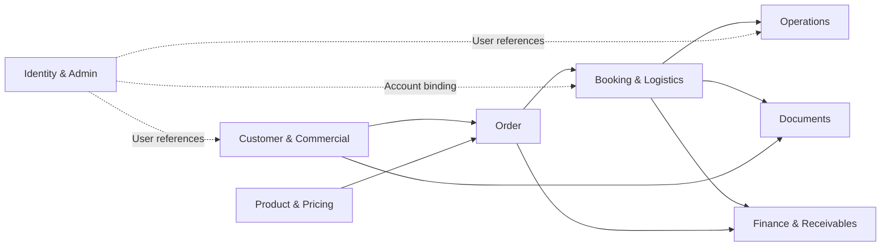
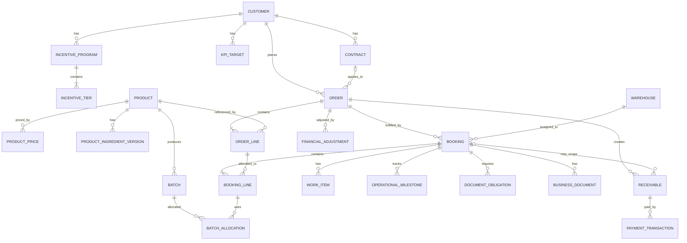

# 02 — Domain Model

## Hệ thống Quản lý Xuất khẩu KDQT (B2B Export Management System)

**Phiên bản:** 0.1  
**Trạng thái:** Draft for Review  
**Ngày cập nhật:** 2026-08-21  
**Baseline:** `docs/00-project-scope.md`  
**Canonical vocabulary:** `docs/01-domain-glossary.md`  
**Quy trình làm rõ:** `docs/HANDOFF.md`  
**Nguồn nghiệp vụ:** `website_modules_analysis.md`, PPTX yêu cầu nghiệp vụ gốc, workbook Excel nghiệp vụ gốc, `phan_tich_chi_tiet_modules.md` và các quyết định được xác nhận trong phiên làm rõ Domain Model.

---

## 1. Mục đích

Tài liệu này xác định Domain Model ở mức nghiệp vụ cho hệ thống quản lý xuất khẩu KDQT.

Mục tiêu là khóa các nội dung sau trước khi đi vào Business Rules, Workflow, Data Dictionary, API và Architecture:

- domain areas và ownership boundary;
- Aggregate Root, Entity, Value Object và reference/master-data candidates;
- canonical relationships và cardinality quan trọng;
- business identifiers;
- lifecycle ownership;
- transaction snapshot boundaries;
- derived data so với persisted business facts;
- cross-domain references;
- các điểm cố ý chưa khóa để xử lý trong tài liệu downstream phù hợp.

Tài liệu này **không phải database schema** và không khóa:

- SQL table/column names;
- EF Core mapping;
- foreign-key implementation chi tiết;
- API endpoint paths;
- UI DTO;
- exact workflow transition matrix;
- mọi validation/business formula.

---

## 2. Nguyên tắc mô hình hóa

### 2.1. Canonical vocabulary trước implementation naming

Các term trong `01-domain-glossary.md` là canonical terms của domain.

Ví dụ:

```text
Order                  // transaction entity
OrderNumber            // internal business identifier
CustomerPoNumber       // external customer reference nếu có

Booking                // shipping/fulfillment entity
BookingCode            // internal business identifier
CarrierBookingNumber   // external carrier reference
ShippingOrderNumber    // external logistics reference
BillOfLadingNumber     // external BL reference
```

Không tạo entity song song chỉ vì source dùng alias khác.

### 2.2. Business entity khác identity

```text
Customer != CustomerAccount != User
Warehouse != WarehouseAccount != User
```

Credential, password, SSO token và authorization implementation không thuộc Customer/Warehouse domain entities.

### 2.3. Transaction data phải ổn định theo thời điểm giao dịch

Các master/default/reference data có thể thay đổi theo thời gian, nhưng Order/Booking đã hình thành phải giữ dữ liệu giao dịch áp dụng tại thời điểm đó.

Ví dụ:

```text
Customer.DefaultIncoterm
Contract.ContractTerms
        ↓ resolve
Order.CommercialSnapshot
```

và:

```text
ProductPrice
        ↓ selected price
OrderLine.UnitPrice
```

OrderLine không đọc động giá hiện tại sau khi giao dịch đã được chốt.

### 2.4. Một business fact chỉ có một source of truth

Không duplicate cùng một fact ở nhiều module chỉ vì workbook hiển thị cùng field ở nhiều sheet.

Ví dụ:

- ETD/ETA/ATD/ATA thuộc logistics facts;
- document issue/received metadata thuộc Documents domain;
- DueDate thuộc Receivable;
- Operations có thể hiển thị các giá trị trên nhưng không trở thành source-of-truth thứ hai.

### 2.5. Derived data không mặc định persisted

Các giá trị như:

- Contract Expiring Soon;
- Outstanding Balance;
- Is Overdue;
- % completion theo PIC;
- current/upcoming ProductPrice;

được xem là derived khi có thể tính đáng tin cậy từ business facts khác.

### 2.6. Không khóa business rule chưa được source/business xác nhận

Domain Model chỉ giữ cấu trúc đủ để biểu diễn requirement đã xác nhận.

Các rule như exact state transitions, price-period overlap, Debit/Credit accounting effect, KPI/Incentive formula và payment warning threshold được chuyển sang tài liệu downstream.

---

# 3. Domain Areas / Ownership Boundaries

Domain được chia thành tám ownership areas ở mức thiết kế hiện tại:

```text
1. Customer & Commercial
2. Product & Pricing
3. Order
4. Booking & Logistics
5. Operations
6. Documents
7. Finance & Receivables
8. Identity & Administration References
```

Đây là ownership boundary cho Domain Model; chưa mặc định đồng nghĩa với tám service/deployment unit độc lập.



---

# 4. Customer & Commercial

## 4.1. Customer — Aggregate Root

`Customer` đại diện cho tổ chức/doanh nghiệp B2B mua hàng.

### Business identifier

```text
Customer.Id             // technical identifier
Customer.CustomerCode   // business identifier
```

Field nguồn `CustomerID` được chuẩn hóa thành `CustomerCode`.

**Invariant đã chốt:**

```text
CustomerCode is globally unique
```

### Core profile

Customer chứa current business profile như:

- short name;
- name VN/EN;
- address VN/EN;
- Tax ID;
- contact information;
- commercial defaults;
- country/market/region references;
- default document requirements.

Exact fields và required/optional rules được khóa ở Data Dictionary.

### Geography / business dimensions

```text
Customer
├── CountryId
├── MarketId
└── RegionId
```

Ba concept độc lập:

```text
Country = quốc gia của Customer
Market  = thị trường kinh doanh/xuất khẩu
Region  = vùng phân luồng nội bộ
```

Không suy diễn Market từ Country hoặc Region từ Country/Market.

### Commercial defaults

Customer giữ bộ giá trị mặc định để hỗ trợ tạo giao dịch:

```text
CommercialDefaults
├── Incoterm
├── PaymentTerm
├── Currency
├── LoadingPort / Origin default
├── Destination default
└── các commercial defaults khác được source xác nhận
```

`BankFee` có tồn tại trong source nhưng exact semantics/value model được để sang Business Rules/Data Dictionary.

### Document requirements mặc định

Customer giữ default required document types.

```text
Customer
└── DefaultDocumentRequirements
```

Đây là entity/value collection thuộc Customer aggregate, không là Aggregate Root riêng.

---

## 4.2. Contract — Aggregate Root

Contract là Aggregate Root riêng, không phải child entity buộc mọi thao tác đi qua Customer.

```text
Customer 1 ─── 0..N Contract
```

Customer có thể tồn tại khi chưa có Contract.

### Identity và business key

```text
Contract
├── Id
├── CustomerId
└── ContractNumber
```

**Invariant đã chốt:**

```text
UNIQUE(CustomerId, ContractNumber)
```

Không mặc định ContractNumber global unique.

### Contract terms

Contract có thể override commercial defaults của Customer.

```text
Customer.CommercialDefaults
            ↓ inherit
Contract.ContractTerms?
            ↓ resolve
Order.CommercialSnapshot
```

Contract terms có thể bao gồm Incoterm, PaymentTerm, Currency, LoadingPort, Destination và các điều kiện thương mại source-supported khác.

### Contract date facts

```text
Contract
├── EffectiveDate
└── ExpiryDate
```

Temporal status được derived:

```text
IsEffective
IsExpired
IsExpiringSoon
```

`ExpiringSoon` không là persisted lifecycle state bắt buộc.

Nếu sau này xuất hiện lifecycle state có semantics độc lập như `Cancelled`, `Terminated` hoặc `Suspended`, workflow/business rules sẽ quyết định persisted state.

### Contract overlap

Domain Model cho phép biểu diễn các effective periods chồng lấn.

Việc business có cho phép overlap hay không **chưa khóa** và thuộc Business Rules.

### Contract document-requirement override

Contract kế thừa Customer defaults và có thể add/remove từng DocumentType.

```text
Customer.DefaultDocumentRequirements
                ↓ inherit
Contract.DocumentRequirementOverrides
                ├── Add(DocumentType)
                └── Remove(DocumentType)
                ↓
EffectiveDocumentRequirements
```

`ContractDocumentRequirementOverride` là entity/value collection trong Contract aggregate, không là Aggregate Root riêng.

---

## 4.3. KpiTarget — Aggregate Root

KPI Target thuộc Customer nhưng có lifecycle theo period riêng, nên không đặt collection lịch sử bên trong Customer aggregate.

```text
Customer 1 ─── N KpiTarget
```

Canonical shape:

```text
KpiTarget
├── CustomerId
├── Year
├── Period
├── Metric
└── TargetValue
```

`Metric` tối thiểu hỗ trợ phân biệt:

```text
Quantity
SalesValue
```

Traceability:

- workbook gốc xác nhận KPI target về **sản lượng** theo quý/năm;
- khả năng biểu diễn `SalesValue` là business clarification đã được xác nhận trong phiên Domain Model để phù hợp requirement Customer Portal so sánh tổng sản lượng và tổng giá trị với target.

Unit, currency và exact KPI formula thuộc Business Rules/Data Dictionary.

---

## 4.4. IncentiveProgram — Aggregate Root

```text
Customer 1 ─── N IncentiveProgram
IncentiveProgram 1 ─── N IncentiveTier
```

Canonical shape:

```text
IncentiveProgram
├── CustomerId
├── Year
├── PeriodType
├── Period?
└── IncentiveTiers
```

`IncentiveTier` là child entity, không là Aggregate Root riêng.

```text
IncentiveTier
└── Level / TierOrder
```

Source hiện có ba mức Quarter Incentive và ba mức Year Incentive, nhưng Domain Model không hard-code thành ba fields.

Threshold, reward, unit và calculation semantics **chưa khóa**.

---

## 4.5. Commercial/reference data

### Controlled reference data

```text
Incoterm
Currency
```

Code của các reference này ổn định và không được coi là user-defined free text.

Source hiện sử dụng tối thiểu:

```text
Incoterm: EXW, FOB, DAT
Currency: VND, USD
```

### Configurable business master data

```text
PaymentTerm
Market
Region
Country
```

`PaymentTerm` là business rule/configuration concept; `DueDate` không nằm trên PaymentTerm mà là ngày cụ thể của Receivable.

---

# 5. Product & Pricing

## 5.1. Product — Aggregate Root

`Product` là canonical entity cho một SKU/mã hàng.

### Business identifier

```text
Product.Id              // technical identifier
Product.ProductionCode  // business identifier
```

**Invariant đã chốt:**

```text
ProductionCode is globally unique
```

### Classification

Source tách hai concepts:

```text
ProductClass
StorageCategory = Chill | Ambient
```

Do đó:

```text
Product
├── ProductClassId
└── StorageCategory
```

`ProductClass != StorageCategory`.

`ProductGroup` và `Brand` chưa được tạo thành domain entities ở version này vì source reporting có nhắc nhóm hàng/thương hiệu nhưng chưa định nghĩa field/taxonomy đủ rõ.

### Tailor-made

```text
Product.IsTailorMade
```

Không tạo `CustomerProduct` chỉ từ field Tailor-made vì source chưa xác nhận tailor-made Product thuộc một Customer cụ thể.

### Barcodes

Product có supplementary identifiers ở các packaging level:

```text
ProductBarcode?
BlockBarcode?
CartonBarcode?
```

Barcode không thay thế ProductionCode.

Unique/check-digit/format rules của barcode chưa khóa trong Domain Model.

### Current specification

Các physical/packaging attributes source-supported như:

- units per carton;
- shelf life;
- storage temperature;
- unit/carton dimensions;
- net/gross weight;
- CBM;
- pallet configuration;
- stuffing note;
- HS Code metadata;
- document/display names;

được xem là current product specification ở version hiện tại.

```text
Product
└── CurrentSpecification
```

Chưa tạo `ProductSpecificationVersion` vì source chưa xác nhận requirement history cho toàn bộ specification.

Các transaction/documents cần lịch sử phải snapshot giá trị cần thiết khi phát sinh.

### Product launch

Source có yêu cầu quản lý sản phẩm mới/sắp ra mắt.

Ở mức Domain Model hiện tại dùng thuộc tính thời gian trên Product, ví dụ semantic `AvailableFrom/PlannedLaunchDate?`; chưa tách aggregate lifecycle riêng.

---

## 5.2. ProductPrice — Aggregate Root

ProductPrice có lifecycle effective-dated riêng và history không được overwrite.

```text
Product 1 ─── N ProductPrice
```

Canonical shape:

```text
ProductPrice
├── ProductId
├── Incoterm
├── Currency
├── Amount
├── EffectiveFrom
└── EffectiveTo?
```

`Current price` và `Upcoming price` là derived view từ effective period; không tạo `Price1`/`Price2` domain concepts.

### FOB/DAT source mapping

Workbook có cột combined `FOB/DAT`.

Domain giữ Incoterm canonical riêng (`FOB`, `DAT`); import layer chịu trách nhiệm mapping source format phù hợp, không tạo canonical enum `FOB_DAT`.

### Price overlap

Domain hỗ trợ effective-dated history nhưng chưa khóa invariant period overlap cho cùng:

```text
Product + Incoterm + Currency
```

Rule này thuộc Business Rules.

---

## 5.3. VAT

VAT là current Product tax attribute ở master data.

```text
Product.VatRate
```

Khi tạo giao dịch:

```text
Product.VatRate
      ↓ apply business rule
OrderLine.VatRate
```

OrderLine giữ VAT áp dụng tại giao dịch.

Exact rule VND/USD thuộc Business Rules.

---

## 5.4. ProductIngredientVersion — Aggregate Root

Source xác nhận Ingredient List VN/EN được cập nhật định kỳ theo tháng, do đó không overwrite history.

```text
Product 1 ─── N ProductIngredientVersion
```

Canonical shape:

```text
ProductIngredientVersion
├── ProductId
├── ContentVi
├── ContentEn
├── EffectiveFrom
└── EffectiveTo?
```

Việc OrderLine/BusinessDocument snapshot content hay reference version cụ thể được quyết định ở Documents/Data Dictionary khi mapping template được khóa.

---

## 5.5. Batch — Aggregate Root

Batch là lô sản xuất thực tế của Product và có identity/traceability riêng.

```text
Product 1 ─── N Batch
```

Canonical shape:

```text
Batch
├── ProductId
├── BatchNumber
└── traceability facts
```

**Business key đã chốt:**

```text
UNIQUE(ProductId, BatchNumber)
```

Cùng BatchNumber có thể tồn tại ở Product khác.

Batch không thuộc độc quyền một Booking.

---

# 6. Order

## 6.1. Order — Aggregate Root

Order là transaction aggregate chính cho một đơn hàng xuất khẩu.

```text
Customer 1 ─── N Order
Order 1 ─── N OrderLine
Order 1 ─── N Booking
```

### Identity

```text
Order
├── Id
└── OrderNumber
```

`OrderNumber` là internal business identifier do hệ thống sinh và global unique.

`CustomerPoNumber?` là external reference nếu nghiệp vụ có Customer PO riêng.

### Customer / Contract references

```text
Order
├── CustomerId    required
└── ContractId    optional
```

Nếu Order áp dụng Contract thì reference Contract cụ thể.

Domain rule xuyên aggregate phải bảo đảm Contract thuộc đúng Customer của Order.

### Commercial snapshot

Order giữ resolved commercial terms thực tế của giao dịch.

```text
Order
└── CommercialSnapshot
    ├── Customer commercial identity/display data cần thiết
    ├── Incoterm
    ├── PaymentTerm
    ├── Currency
    ├── Origin/Loading terms
    ├── Destination terms
    └── các commercial facts cần ổn định theo transaction
```

Thay đổi Customer/Contract sau đó không tự làm thay đổi Order cũ.

### Responsible user / PIC

Order có thể reference primary responsible user theo source nghiệp vụ.

```text
Order.ResponsibleUserId?
```

Exact permission/assignment rules thuộc Role & Permission/Business Rules.

### Lifecycle

Order sở hữu lifecycle status riêng.

Domain Model chỉ khóa **existence and ownership** của status, chưa khóa exact enum vì source dùng wording chưa hoàn toàn nhất quán giữa `Tạo mới`, `Phát hành`, `Hoàn thành`, `Đã thanh toán`.

Exact transition matrix thuộc Workflow document.

---

## 6.2. OrderLine — child Entity

```text
Order
└── OrderLines
```

OrderLine reference Product nhưng giữ transaction snapshot.

Canonical shape ở mức domain:

```text
OrderLine
├── ProductId
├── ProductSnapshot
├── OrderedQuantity
├── UnitOfMeasure
├── UnitPrice
├── VatRate
├── Discount / price-adjustment inputs
├── LabelFee / other commercial inputs
├── IsFoc
└── FulfillmentStatus
```

### Product snapshot

OrderLine snapshot các Product facts cần ổn định cho giao dịch/chứng từ, thay vì đọc động CurrentSpecification khi render lại historical transaction.

Exact snapshot field list thuộc Data Dictionary/Document Mapping.

### FOC

FOC được biểu diễn rõ ở OrderLine bằng `IsFoc`; không biến FOC thành một phép trừ ngầm làm mất traceability.

Exact effect lên ordered quantity, invoice value, booked quantity và KPI thuộc Business Rules.

### Fulfillment state

Source cho phép đánh dấu từng mã hàng hoàn thành để không tiếp tục xuất hiện như quantity còn phải booking.

Do đó OrderLine có fulfillment concept riêng.

Exact statuses/calculation của `BookedQuantity` và `RemainingQuantity` thuộc Workflow/Business Rules.

---

## 6.3. FinancialAdjustment — Aggregate Root

FinancialAdjustment được tách khỏi Order aggregate để có lifecycle/audit độc lập và tránh phình Order aggregate.

```text
Order 1 ─── N FinancialAdjustment
```

Các source labels/concepts gồm:

- Incentive Quarter/Year;
- Debit Note;
- Credit Note;
- các adjustment khác nếu nghiệp vụ xác nhận.

Canonical shape:

```text
FinancialAdjustment
├── OrderId
├── ReceivableId?
├── Type
├── Amount / Value representation
├── Currency?
└── metadata
```

Workbook convention hiện tại:

```text
Debit Note  = subtractive / negative
Credit Note = additive / positive
```

Domain Model không tự diễn giải accounting perspective; exact effect lên Final Amount/Receivable thuộc Business Rules.

---

# 7. Booking & Logistics

## 7.1. Booking — Aggregate Root

Booking là đơn vị shipping/fulfillment chính.

```text
Order 1 ─── N Booking
```

Không tạo `Shipment` entity song song ở scope hiện tại.

### Identifiers

Tách internal và external references:

```text
BookingCode
CarrierBookingNumber?
ShippingOrderNumber?
BillOfLadingNumber?
```

`BookingCode` là internal business identifier và global unique.

`SO` tiếp tục là working interpretation `Shipping Order`; không tạo ShippingOrder aggregate riêng khi source chưa xác nhận lifecycle/semantics đầy đủ.

### Lifecycle

Booking sở hữu lifecycle riêng.

Source-confirmed flow có:

```text
Phát hành → Ongoing → Đang giao → Đã giao
```

Scope cho phép Draft/Hold/Cancelled.

Exact normalized states, permissions, transitions và side effects thuộc Workflow document.

---

## 7.2. BookingLine — child Entity

BookingLine là phần quantity của một OrderLine được phân vào Booking.

```text
OrderLine 1 ─── N BookingLine
Booking   1 ─── N BookingLine
```

Canonical relationship:

```text
BookingLine
├── OrderLineId
├── ProductId/reference
├── BookedQuantity
└── Fulfillment/Completion concept
```

Reference `OrderLineId` là bắt buộc để kiểm soát allocation và remaining quantity của OrderLine.

---

## 7.3. Warehouse assignment

Một Booking có một primary Warehouse đóng hàng.

```text
Booking N ─── 1 Warehouse
```

Nếu một Order cần xuất từ nhiều Warehouse, tạo nhiều Booking tương ứng.

Warehouse là business/master entity riêng, không chỉ là text trên Booking.

---

## 7.4. BatchAllocation — child Entity

BatchAllocation nối BookingLine với Batch và mang quantity được lấy từ batch đó.

```text
BookingLine 1 ─── N BatchAllocation
Batch       1 ─── N BatchAllocation
```

Canonical shape:

```text
BatchAllocation
├── BatchId
└── Quantity
```

Một BookingLine có thể dùng nhiều Batch; một Batch có thể được dùng trong nhiều BookingLine/Booking.

---

## 7.5. TransportEquipment — child Entity

Một Booking có thể có nhiều equipment/container.

```text
Booking
└── TransportEquipment(s)
    ├── EquipmentType
    ├── ContainerNumber?
    └── SealNumber?
```

Phân biệt:

```text
TransportMode      = Sea | Air | Road | Rail
ShipmentLoadType   = FCL | LCL
EquipmentType      = 20DC | 40DC | 40HC | 20RF | 40RF | ...
```

`LCL` không phải EquipmentType.

---

## 7.6. Carrier

Carrier là canonical master/domain entity cho đơn vị trực tiếp vận chuyển.

```text
Booking N ─── 0..1 Carrier
```

Exact cardinality/required rule có thể phụ thuộc workflow và được khóa sau.

`Shipping Line` là Sea Carrier, không là field canonical cho mọi mode.

Forwarder chưa là core domain concept bắt buộc.

---

## 7.7. Logistics locations

Domain dùng canonical concepts:

```text
OriginLocation
DestinationLocation
```

POL/POD là aliases theo Sea context.

Dùng reference/master concept `LogisticsLocation` ở mức đơn giản; location hierarchy chưa khóa.

---

## 7.8. Logistics time facts

Phân biệt rõ:

```text
PlannedLoadingDate
WarehouseReleaseDate
ETD
ATD
ETA
ATA
```

Không đồng nhất ETD với Loading Date dù source cũ dùng wording nhập nhằng.

---

## 7.9. LoadingSchedule — Aggregate Root

LoadingSchedule mô tả kế hoạch/progress tại Warehouse trước khi hàng rời kho.

```text
Booking 1 ─── 0..1 LoadingSchedule
```

Warehouse Portal được phép cập nhật các facts/status trong phạm vi được phân công.

Exact workflow (`Đã hold hàng`, `Đã dán tem`, `Đã giao hàng`, ...) thuộc Workflow document.

---

## 7.10. DeliverySchedule — Aggregate Root

DeliverySchedule mô tả lịch logistics tổng thể của Booking và được KDQT/Warehouse phối hợp cập nhật.

```text
Booking 1 ─── 0..1 DeliverySchedule
```

Có thể chứa/refer các facts như:

- warehouse release;
- origin/destination;
- ETD/ETA;
- driver information;
- notes;
- quarantine/fumigation flags;
- logistics display facts khác.

### Driver

Driver hiện là Value Object trong delivery data:

```text
DriverInfo
├── Name
├── Identifier
└── Phone
```

Chưa tạo Driver master entity vì source không có module quản lý driver độc lập.

---

# 8. Operations

## 8.1. WorkItem — Aggregate Root

WorkItem là đơn vị công việc vận hành cần thực hiện cho Booking.

```text
Booking 1 ─── N WorkItem
```

Canonical shape:

```text
WorkItem
├── BookingId
├── Title / Type
├── PrimaryPicUserId
├── Deadline
├── Status
└── completion metadata
```

### Assignment

Ở version hiện tại:

```text
WorkItem has one Primary PIC
```

Không thêm multiple-assignee/collaborator model khi source chưa yêu cầu.

### Status

Source xác nhận tối thiểu Ongoing/Completed cho operation work.

Exact lifecycle mở rộng thuộc Workflow document.

### Derived reporting

Các metric sau không mặc định persisted:

```text
IsOverdue
OnTime/Overdue ratio
Ongoing/Completed ratio by PIC
```

---

## 8.2. OperationalMilestone — Aggregate Root

OperationalMilestone là mốc/sự kiện nghiệp vụ, khác WorkItem.

```text
Booking 1 ─── N OperationalMilestone
```

Canonical shape:

```text
OperationalMilestone
├── BookingId
├── MilestoneTypeId
├── PlannedAt?
├── ActualAt?
└── milestone-specific metadata
```

`MilestoneType` là configurable/reference concept, không hard-code toàn bộ workbook milestones thành một enum cố định.

### Source-of-truth rule

Không duplicate facts đã có owner domain rõ:

- ETD/ATD/ETA/ATA → Booking/Logistics;
- container/seal/driver → Logistics;
- document issue/received/number → Documents khi là document facts.

OperationalMilestone dùng cho process milestone thực sự như checking batch, raw material, production completion, cut-off, docs sent và các operational event khác sau khi mapping source được xác nhận.

---

# 9. Documents

## 9.1. DocumentType — controlled reference data

DocumentType phân loại chứng từ.

Các types source/glossary hiện có gồm:

- Purchase Order;
- Quotation;
- Proforma Invoice;
- Commercial Invoice;
- Packing List;
- Batch Information;
- Bill of Lading;
- Certificate of Origin;
- Customs Declaration;
- Health Certificate.

Danh sách có thể mở rộng có kiểm soát.

---

## 9.2. DocumentRequirement ownership

Customer/Contract chỉ định default/override requirements.

Không có aggregate `DocumentRequirement` độc lập.

```text
Customer.DefaultDocumentRequirements
Contract.DocumentRequirementOverrides
```

---

## 9.3. DocumentObligation — Aggregate Root

Để transaction lịch sử không bị thay đổi khi Customer/Contract requirement thay đổi, Booking snapshot các document obligations thực tế.

```text
Booking 1 ─── N DocumentObligation
```

Canonical shape:

```text
DocumentObligation
├── BookingId
├── DocumentTypeId
├── requirement/source metadata
└── fulfillment metadata/status concept
```

DocumentObligation trả lời câu hỏi:

> Booking này thực tế phải chuẩn bị những chứng từ nào?

Nó khác với Customer default requirement và khác BusinessDocument instance.

---

## 9.4. BusinessDocument — Aggregate Root

BusinessDocument là một chứng từ thực tế được tracking/lưu trong hệ thống.

```text
BusinessDocument
├── DocumentTypeId
├── OrderId?
├── BookingId?
├── DocumentNumber?
├── SourceType
└── metadata
```

Không dùng generic polymorphic `OwnerType/OwnerId` khi Order/Booking là các owner/reference chính đã biết.

### Source type

```text
SystemGenerated
ExternalUploaded
```

Không cần inheritance hierarchy riêng trong persistence chỉ để phân biệt source.

### System-generated candidates

Source xác nhận khả năng render theo template cho:

**Order context:**

- Purchase Order;
- Proforma Invoice;
- Quotation.

**Booking context:**

- Commercial Invoice (`IV` alias);
- Packing List;
- Batch Information.

### External/uploaded/tracked candidates

Trong scope hiện tại chủ yếu gồm:

- Bill of Lading;
- Customs Declaration / TKHQ;
- Certificate of Origin / CO;
- Health Certificate / HC;
- certificates/documents do external party phát hành.

Không mặc định hệ thống generate các external documents này.

---

## 9.5. Health Certificate subtype

Không tạo nhiều class khác nhau cho từng HC source label.

Model:

```text
DocumentType = HealthCertificate
Subtype      = Vessel | Air | Veterinary | HealthDepartment | Other
```

Exact subtype taxonomy có thể được mở rộng trong master data.

---

## 9.6. DocumentTemplate — Aggregate Root

```text
DocumentTemplate
└── DocumentTemplateVersion(s)
```

Template có history/version; system-generated BusinessDocument phải giữ reference đến template version đã dùng để bảo đảm historical reproducibility.

Exact rendering engine/file format/mapping không thuộc Domain Model.

---

## 9.7. BusinessDocument revisions

BusinessDocument không overwrite file/revision lịch sử khi có bản mới.

```text
BusinessDocument
└── DocumentRevision(s)
```

Revision giữ file/reference metadata và, với generated document, `TemplateVersionId` phù hợp.

Exact approval/version status workflow chưa khóa.

---

# 10. Finance & Receivables

## 10.1. CostType — configurable master data

Source có nhiều loại chi phí và workbook thực tế có taxonomy lớn hơn danh sách tóm tắt.

Không tạo một cột/domain field cho từng cost type.

```text
CostType
├── Code
├── Name
└── IsActive / classification metadata
```

---

## 10.2. Vendor — master Entity

Workbook có Vendor Code/Name trong cost data, do đó Vendor là master entity riêng nhưng reference có thể optional tùy CostItem.

```text
Vendor
├── VendorCode
└── VendorName
```

Exact unique/business rules thuộc Data Dictionary.

---

## 10.3. BookingCostStatement — Aggregate Root

Chi phí được quản lý theo Booking.

```text
Booking 1 ─── 0..N BookingCostStatement
```

Exact cardinality có thể được rút về một active statement/version strategy trong Business Rules/Data Dictionary; Domain Model giữ aggregate riêng để quản lý status/audit độc lập.

Canonical shape:

```text
BookingCostStatement
├── BookingId
├── Status
└── CostItems
```

`CostItem` là child entity:

```text
CostItem
├── CostTypeId
├── VendorId?
├── Currency
├── UnitPrice / Amount inputs
├── ExchangeRate?
├── Quantity?
├── VatRate?
├── SupplierInvoiceNumber?
└── Note?
```

Exact calculation, approval và publishing rules thuộc Business Rules/Workflow.

---

## 10.4. Receivable — Aggregate Root

Receivable là khoản phải thu.

Model được chọn để hỗ trợ cả Order-level và Booking-specific receivables mà không cần đổi domain shape sau này:

```text
Receivable
├── OrderId      required
├── BookingId?   optional
├── AmountDue
├── Currency
├── DueDate
└── PaymentTransactions
```

```text
Order 1 ─── N Receivable
Booking 1 ─── 0..N Receivable
```

Exact generation/cardinality rule được khóa trong Business Rules sau khi nghiệp vụ xác nhận cách phát sinh khoản phải thu theo Order/Booking.

### DueDate

`DueDate` source-of-truth nằm trên Receivable.

PaymentTerm là rule/input; DueDate là ngày cụ thể của khoản phải thu.

---

## 10.5. PaymentTransaction — child Entity

```text
Receivable 1 ─── N PaymentTransaction
```

Hỗ trợ partial payment / nhiều lần thanh toán.

Canonical shape ở mức domain:

```text
PaymentTransaction
├── Amount
├── Currency
├── PaidAt
└── reference/metadata
```

Bank reconciliation model chưa tạo vì source chưa yêu cầu.

---

## 10.6. Derived receivable data

Các giá trị sau là derived:

```text
AmountPaid          = aggregate PaymentTransaction
OutstandingBalance  = AmountDue - applicable payments/adjustments
IsOverdue           = DueDate + current time + outstanding rule
PaymentStatus       = derived/lifecycle rule to be finalized
```

Exact refund, FX, adjustment và overdue-warning rules thuộc Business Rules.

---

## 10.7. FinancialAdjustment relation

FinancialAdjustment có OrderId và có thể liên kết Receivable khi adjustment đã được áp vào một khoản phải thu cụ thể.

Exact mapping từ Debit/Credit/Incentive sang Receivable amount không khóa trong Domain Model.

---

# 11. Identity & Administration References

## 11.1. User — Identity Aggregate Root

`User` thuộc Identity boundary.

Authentication details như local credential, SSO mapping, token, MFA và session không được đưa vào business aggregates trong tài liệu này.

---

## 11.2. CustomerAccount

CustomerAccount là binding giữa User và Customer để xác định Customer Portal data scope.

```text
Customer 1 ─── 1 CustomerAccount
CustomerAccount ─── 1 User
```

Theo scope hiện tại, mỗi Customer có đúng một Customer Account.

---

## 11.3. WarehouseAccount

WarehouseAccount là binding giữa User và Warehouse.

```text
Warehouse 1 ─── 1 WarehouseAccount
WarehouseAccount ─── 1 User
```

Theo scope hiện tại, mỗi Warehouse có đúng một Warehouse Account.

---

## 11.4. KDQT / Finance / System Admin users

Không tạo business entities riêng như:

```text
KdqtAccount
FinanceAccount
AdminAccount
```

Các nhóm này là User + Role/Permission/Data Scope theo authorization design.

Business domain chỉ reference `UserId` khi cần, ví dụ:

- WorkItem Primary PIC;
- Order responsible user;
- audit CreatedBy/UpdatedBy.

---

## 11.5. Master-data governance

Không tạo một generic aggregate kiểu:

```text
MasterData(Key, Value)
```

cho toàn bộ hệ thống.

Các concepts có semantics riêng giữ model riêng, ví dụ:

- Country;
- Market;
- Region;
- ProductClass;
- PaymentTerm;
- CostType;
- Carrier;
- DocumentType;
- LogisticsLocation.

System Administration cung cấp capability quản lý các master/reference data theo permission, nhưng không làm mất semantics domain của từng loại.

---

## 11.6. Audit

Audit Log là cross-cutting capability.

Audit record không thuộc ownership của một business aggregate cụ thể và không được dùng thay cho domain history/version model khi business cần history thực sự.

---

# 12. Aggregate Map

## 12.1. Aggregate Roots đã xác định

| Domain area | Aggregate Root | Ghi chú |
|---|---|---|
| Customer & Commercial | Customer | Customer profile/defaults/document defaults |
| Customer & Commercial | Contract | Lifecycle/terms riêng, reference Customer |
| Customer & Commercial | KpiTarget | Theo Customer + period + metric |
| Customer & Commercial | IncentiveProgram | Có child IncentiveTier |
| Product & Pricing | Product | SKU/master specification |
| Product & Pricing | ProductPrice | Effective-dated price history |
| Product & Pricing | ProductIngredientVersion | Effective-dated ingredient history |
| Product & Pricing | Batch | Product traceability lot |
| Order | Order | Có child OrderLine |
| Order/Finance | FinancialAdjustment | Adjustment độc lập |
| Booking & Logistics | Booking | Có child BookingLine, equipment, batch allocations |
| Booking & Logistics | LoadingSchedule | Warehouse loading workflow ownership |
| Booking & Logistics | DeliverySchedule | Delivery/logistics schedule ownership |
| Operations | WorkItem | PIC/deadline/status |
| Operations | OperationalMilestone | Process milestone tracking |
| Documents | DocumentObligation | Snapshot required docs cho Booking |
| Documents | BusinessDocument | Document instance/revisions |
| Documents | DocumentTemplate | Có template versions |
| Finance | BookingCostStatement | Có child CostItems |
| Finance | Receivable | Có child PaymentTransactions |
| Identity | User | Authentication/identity boundary |

---

## 12.2. Important child Entities / Value Objects

| Owner | Child / Value Object |
|---|---|
| Customer | CommercialDefaults |
| Customer | CustomerDocumentRequirement |
| Contract | ContractTerms |
| Contract | ContractDocumentRequirementOverride |
| IncentiveProgram | IncentiveTier |
| Product | CurrentSpecification |
| Order | CommercialSnapshot |
| Order | OrderLine |
| OrderLine | ProductSnapshot |
| Booking | BookingLine |
| Booking | TransportEquipment |
| BookingLine | BatchAllocation |
| DeliverySchedule | DriverInfo |
| BusinessDocument | DocumentRevision |
| DocumentTemplate | DocumentTemplateVersion |
| BookingCostStatement | CostItem |
| Receivable | PaymentTransaction |

---

# 13. Canonical Relationship Overview



Mermaid diagram chỉ thể hiện relationship ở mức conceptual; optionality/physical FK implementation vẫn thuộc Data Dictionary.

---

# 14. Persisted Facts vs Derived Data

| Concept | Direction |
|---|---|
| Contract EffectiveDate / ExpiryDate | Persisted business facts |
| Contract Effective / Expired / ExpiringSoon display | Derived temporal state |
| ProductPrice effective period + amount | Persisted |
| Current ProductPrice | Derived |
| Upcoming ProductPrice | Derived |
| Order CommercialSnapshot | Persisted transaction fact |
| OrderLine UnitPrice/VatRate/ProductSnapshot | Persisted transaction facts |
| Booked/Remaining quantity | Derived from approved allocation/business rules unless downstream requires persisted optimization |
| WorkItem Deadline/Status | Persisted |
| WorkItem IsOverdue | Derived |
| Delivery ETD/ETA/ATD/ATA | Persisted logistics facts |
| Customer Portal Planning/On The Way/Completed grouping | Derived from Booking lifecycle/workflow |
| Receivable AmountDue/DueDate | Persisted |
| PaymentTransaction | Persisted |
| AmountPaid | Derived aggregate |
| OutstandingBalance | Derived |
| Overdue days/status | Derived |
| Dashboard/KPI aggregations | Derived/reporting data unless a future reporting design introduces materialized projections |

---

# 15. Domain-Level Invariants / Constraints đã chốt

Các invariants dưới đây đủ rõ để Domain Model ghi nhận:

1. `CustomerCode` global unique.
2. `ProductionCode` global unique.
3. `BookingCode` global unique.
4. `OrderNumber` global unique.
5. `ContractNumber` unique trong phạm vi Customer.
6. `BatchNumber` unique trong phạm vi Product.
7. Order luôn có Customer; Contract reference là optional.
8. Contract reference của Order, nếu có, phải thuộc cùng Customer.
9. Customer có `0..N` Contract.
10. Order có `1..N` OrderLine khi đạt trạng thái nghiệp vụ yêu cầu line; exact draft validation thuộc Business Rules.
11. Order `1:N` Booking.
12. BookingLine phải trace về OrderLine.
13. Một Booking có một primary Warehouse theo model hiện tại.
14. BatchAllocation nối BookingLine với Batch và mang quantity.
15. CustomerAccount binding 1:1 với Customer theo Project Scope.
16. WarehouseAccount binding 1:1 với Warehouse theo Project Scope.
17. Finance Portal read-only là authorization/scope constraint, không làm Finance data thành duplicate read model source-of-truth.

---

# 16. Intentionally Deferred Decisions

Các nội dung dưới đây **không được coi là thiếu sót của Domain Model**; chúng phải được xử lý ở tài liệu phù hợp sau khi có đủ business evidence.

## 16.1. Business Rules

- Contract effective-period overlap rule.
- Customer/Contract rule khi phát hành Order.
- CustomerCode/OrderNumber/BookingCode exact generation format.
- Barcode format/check digit/uniqueness.
- ProductPrice overlap rule.
- ProductPrice selection rule khi có effective-date boundary.
- VAT VND/USD exact calculation.
- FOC effect lên quantity/value/KPI.
- BookedQuantity/RemainingQuantity formula.
- KPI exact calculation, unit và target aggregation.
- Incentive threshold/reward/calculation.
- Debit/Credit Note exact accounting perspective/effect.
- Payment DueDate calculation from PaymentTerm.
- Partial payment/refund/FX rules.
- Cost calculation, exchange-rate and approval rules.
- Receivable generation cardinality/rules theo Order/Booking.

## 16.2. Workflow / State Machines

- exact Order states/transitions;
- exact Booking states/transitions/side effects;
- OrderLine fulfillment transitions;
- BookingLine completion transitions;
- Warehouse loading status model;
- cost statement lifecycle;
- document obligation/document workflow;
- Contract persisted lifecycle states nếu có ngoài date-derived state.

## 16.3. Data Dictionary / Master Data

- ProductGroup/Brand taxonomy nếu business xác nhận khác ProductClass;
- ProductClass values;
- ContractType taxonomy;
- Region taxonomy beyond current source Bắc/Nam;
- location hierarchy;
- Health Certificate subtype full taxonomy;
- Batch additional traceability fields;
- Vendor unique/business rules;
- exact Product snapshot fields;
- exact CommercialSnapshot fields.

## 16.4. Documents / Integration

- official template files;
- template rendering engine;
- template field mapping;
- document approval/version status;
- official meaning/lifecycle của `SO` nếu upstream xác nhận khác working interpretation `Shipping Order`;
- external document integrations, hiện Future Scope.

---

# 17. Decision Register — Customer & Commercial

| ID | Quyết định |
|---|---|
| C1-01 | Customer giữ commercial defaults; Contract có thể override; Order snapshot commercial terms thực tế |
| C1-02 | Order.CustomerId required; Order.ContractId optional |
| C1-03 | KPI Target và Incentive thuộc Customer theo kỳ nhưng model thành concepts riêng |
| C1-04 | Market và Region là master data độc lập, Customer reference một giá trị mỗi loại |
| C1-05 | Customer có default DocumentRequirements; Contract có override |
| C1-06 | Source `CustomerID` chuẩn hóa thành globally unique `CustomerCode`, tách technical `Id` |
| C1-07 | `ContractNumber` unique trong phạm vi Customer |
| C1-08 | Domain cho phép biểu diễn contract effective-period overlap; exact business rule deferred |
| C1-09 | Contract document override dùng inherit + add/remove từng DocumentType |
| C1-10 | KpiTarget có `Metric`, tối thiểu Quantity và SalesValue; source gốc chỉ xác nhận Quantity target |
| C1-11 | Country tách khỏi Market và Region |
| C1-12 | Incoterm/Currency là controlled references; PaymentTerm là configurable business master |
| C1-13 | IncentiveProgram `1:N IncentiveTier`; không hard-code ba fields |
| C1-14 | IncentiveTier hiện chỉ khóa Level/TierOrder; threshold/reward semantics deferred |
| C1-15 | Contract temporal status derived từ EffectiveDate/ExpiryDate; persisted lifecycle khác chỉ thêm khi có semantics riêng |
| C1-16 | Customer `1 → 0..N Contract` |
| C1-17 | Customer và Contract là hai Aggregate Roots riêng |
| C1-18 | KpiTarget và IncentiveProgram là Aggregate Roots riêng; IncentiveTier là child Entity |
| C1-19 | DocumentRequirement không là Aggregate Root; nằm trong Customer/Contract aggregates |

---

# 18. Decision Register — Product & Pricing

| ID | Quyết định |
|---|---|
| C2-01 | ProductPrice là Aggregate Root riêng reference Product |
| C2-02 | Effective-dated price history được hỗ trợ; exact overlap rule deferred |
| C2-03 | ProductionCode global unique |
| C2-04 | Batch là Aggregate Root riêng reference Product |
| C2-05 | BatchNumber unique trong phạm vi Product |
| C2-06 | Ingredient List dùng ProductIngredientVersion Aggregate Root/history |
| C2-07 | Packaging/physical data giữ current Product specification; transaction snapshot dữ liệu cần lịch sử |
| C2-08 | Tách ProductClass khỏi StorageCategory (Chill/Ambient); ProductGroup/Brand deferred khi taxonomy chưa rõ |
| C2-09 | Barcode là supplementary identifiers; exact uniqueness/format deferred |
| C2-10 | Current/Upcoming price là derived từ một ProductPrice history model, không có Price1/Price2 domain concepts |
| C2-11 | Source FOB/DAT được normalize về canonical FOB và DAT, không tạo enum `FOB_DAT` |
| C2-12 | Tailor-made là Product attribute; chưa tạo CustomerProduct |
| C2-13 | VAT là Product current attribute; OrderLine snapshot VAT áp dụng |
| C2-14 | Planned product launch giữ temporal attribute trên Product ở mức hiện tại |

---

# 19. Decision Register — Remaining Domain Areas

## Order

| ID | Quyết định |
|---|---|
| C3-01 | Order AR, OrderLine child Entity |
| C3-02 | OrderNumber global unique |
| C3-03 | Order owns lifecycle status; exact states deferred to Workflow |
| C3-04 | Order giữ CustomerId required, ContractId optional và CommercialSnapshot |
| C3-05 | OrderLine giữ Product/price/tax/packaging transaction snapshot cần thiết |
| C3-06 | FOC biểu diễn rõ bằng OrderLine `IsFoc` |
| C3-07 | FinancialAdjustment là Aggregate Root riêng liên kết Order |
| C3-08 | OrderLine có fulfillment/completion concept riêng |
| C3-09 | Order có thể reference responsible User/PIC |
| C3-10 | DueDate source-of-truth thuộc Receivable, không Order |

## Booking & Logistics

| ID | Quyết định |
|---|---|
| C4-01 | Booking AR, BookingLine child Entity |
| C4-02 | BookingCode global unique; tách CarrierBookingNumber/ShippingOrderNumber/BillOfLadingNumber |
| C4-03 | BookingLine bắt buộc trace về OrderLine |
| C4-04 | Một Booking có một primary Warehouse |
| C4-05 | BatchAllocation nối BookingLine với Batch và mang quantity |
| C4-06 | TransportEquipment là child Entity; Booking có thể có nhiều equipment/container |
| C4-07 | Carrier là canonical entity; Shipping Line là Sea Carrier |
| C4-08 | LoadingSchedule và DeliverySchedule là Aggregate Roots riêng liên kết Booking |
| C4-09 | Driver là Value Object trong delivery data ở scope hiện tại |
| C4-10 | Dùng LogisticsLocation reference đơn giản; hierarchy deferred |
| C4-11 | BookingLine có completion/fulfillment concept riêng |
| C4-12 | SO tiếp tục là external reference/working interpretation; không tạo ShippingOrder aggregate |

## Operations

| ID | Quyết định |
|---|---|
| C5-01 | WorkItem là Aggregate Root reference Booking |
| C5-02 | WorkItem có một Primary PIC ở model hiện tại |
| C5-03 | OperationalMilestone là Aggregate Root reference Booking |
| C5-04 | MilestoneType configurable/reference, không fixed enum toàn workbook |
| C5-05 | Logistics facts không duplicate vào Operations |
| C5-06 | Document facts thuộc Documents khi có owner rõ |
| C5-07 | Process-specific milestones mới nằm trong OperationalMilestone |
| C5-08 | Overdue/PIC ratios là derived reporting data |

## Documents

| ID | Quyết định |
|---|---|
| C6-01 | DocumentType là controlled reference data |
| C6-02 | DocumentObligation AR snapshot requirement thực tế theo Booking |
| C6-03 | BusinessDocument AR dùng SourceType `SystemGenerated | ExternalUploaded` |
| C6-04 | BusinessDocument dùng explicit OrderId?/BookingId? thay generic polymorphic owner |
| C6-05 | DocumentTemplate AR; DocumentTemplateVersion child history |
| C6-06 | BusinessDocument có revision history, không overwrite historical file |
| C6-07 | Exact document approval/status workflow deferred |
| C6-08 | HC dùng one DocumentType + controlled subtype |
| C6-09 | PO/PI/Quotation và IV/PL/BatchInformation là system-generation candidates; BL/CO/TKHQ/HC mặc định external/tracked |
| C6-10 | Generated revision giữ TemplateVersion reference |

## Finance

| ID | Quyết định |
|---|---|
| C7-01 | BookingCostStatement AR, CostItem child Entity |
| C7-02 | CostType configurable master data; không hard-code danh mục chi phí thành columns |
| C7-03 | Vendor là optional master reference cho CostItem |
| C7-04 | Cost lifecycle thuộc CostStatement; exact states deferred |
| C7-05 | Receivable AR có OrderId required và BookingId optional |
| C7-06 | PaymentTransaction child Entity của Receivable; hỗ trợ partial payments |
| C7-07 | OutstandingBalance/payment warning status là derived |
| C7-08 | DueDate source-of-truth nằm trên Receivable |
| C7-09 | FinancialAdjustment có thể liên kết Receivable khi áp dụng cụ thể; exact effect deferred |
| C7-10 | Chưa tạo Bank/Reconciliation aggregate khi source chưa yêu cầu |

## Identity / Administration

| ID | Quyết định |
|---|---|
| C8-01 | User thuộc Identity context |
| C8-02 | CustomerAccount là 1:1 binding Customer ↔ User |
| C8-03 | WarehouseAccount là 1:1 binding Warehouse ↔ User |
| C8-04 | KDQT/Finance/Admin là User + permission, không tạo business account entity riêng |
| C8-05 | Business domains chỉ giữ UserId references khi cần, không chứa credentials/token |
| C8-06 | Không dùng generic MasterData key/value cho mọi domain reference |
| C8-07 | Audit Log là cross-cutting capability |

---

# 20. Consistency with Project Scope and Glossary

Domain Model này giữ nguyên các baseline quan trọng:

- toàn bộ 20 modules vẫn In Scope;
- Customer Portal read-own;
- Warehouse scope theo Warehouse;
- Finance read-only;
- `Order 1:N Booking`;
- Booking là shipping unit chính, không có Shipment entity riêng;
- ProductPrice có history;
- OrderLine giữ transaction price;
- BatchAllocation ở BookingLine;
- WorkItem tách khỏi Booking status;
- Receivable hỗ trợ multiple PaymentTransactions;
- BusinessDocument phân biệt generated/external;
- Market khác Region;
- Customer/Warehouse business entity tách Identity.

Nếu downstream design phát hiện thuật ngữ mới/mâu thuẫn, phải cập nhật `01-domain-glossary.md` trước hoặc cùng PR phù hợp; không tạo hai canonical meanings khác nhau.

---

# 21. Definition of Done cho Domain Model

- [x] Consistent với `00-project-scope.md`.
- [x] Dùng canonical terminology từ `01-domain-glossary.md`.
- [x] Đã làm rõ tám cluster theo quy trình HANDOFF.
- [x] Các relationship quan trọng đã được business-approved trong chat.
- [x] Không biến tài liệu thành SQL/EF schema.
- [x] Snapshot boundaries được xác định cho transaction history.
- [x] Derived data được tách khỏi persisted business facts ở mức domain.
- [x] Các workflow/business formula chưa đủ nguồn được deferred rõ ràng.
- [ ] Independent PR review.
- [ ] Review blockers được xử lý trước merge.

---

# 22. Version History

| Version | Date | Description |
|---|---|---|
| 0.1 | 2026-08-21 | Khởi tạo Domain Model sau khi làm rõ tám cluster Customer/Commercial, Product/Pricing, Order, Booking/Logistics, Operations, Documents, Finance và Identity/Admin theo quy trình HANDOFF. |
