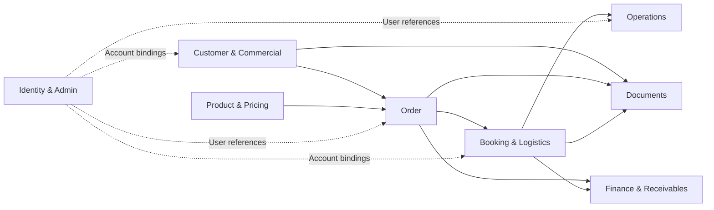
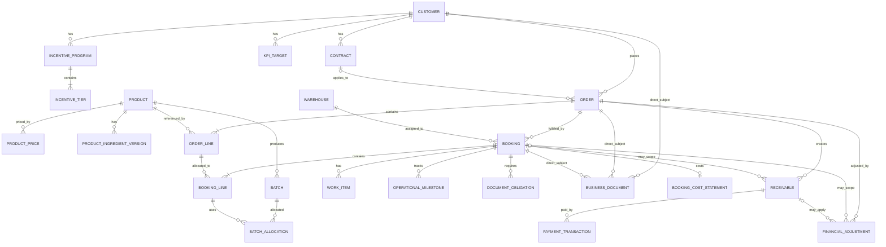

# 02 — Domain Model

## Hệ thống Quản lý Xuất khẩu KDQT (B2B Export Management System)

**Phiên bản:** 0.2  
**Trạng thái:** Draft for Re-review  
**Ngày cập nhật:** 2026-08-21  
**Baseline:** `docs/00-project-scope.md`  
**Canonical vocabulary:** `docs/01-domain-glossary.md`  
**Quy trình làm rõ:** `docs/HANDOFF.md`  
**Nguồn nghiệp vụ:** `website_modules_analysis.md`, PPTX yêu cầu nghiệp vụ gốc, workbook Excel nghiệp vụ gốc, `phan_tich_chi_tiet_modules.md` và các quyết định được xác nhận trong phiên làm rõ Domain Model.

---

# 1. Mục đích và phạm vi

Tài liệu này xác định Domain Model ở mức nghiệp vụ cho hệ thống quản lý xuất khẩu KDQT.

Tài liệu khóa:

- domain ownership boundaries;
- Aggregate Root, Entity, Value Object và master/reference concepts;
- các relationship/cardinality đủ căn cứ;
- business identifiers;
- transaction snapshot boundaries;
- persisted facts so với derived data;
- cross-domain references;
- các quyết định cố ý deferred sang Business Rules, Workflow, Data Dictionary, Documents hoặc Architecture.

Tài liệu này **không phải database schema** và không khóa SQL table/column, EF mapping, API path, DTO, exact transition matrix hoặc công thức chưa được business/source xác nhận.

---

# 2. Nguyên tắc mô hình hóa

## 2.1. Canonical vocabulary trước implementation naming

Các term trong `01-domain-glossary.md` là canonical terms. Alias từ workbook/PPTX phải map về canonical concept, không tạo entity song song chỉ vì tên nguồn khác nhau.

Ví dụ:

```text
OrderNumber             // internal business identifier
CustomerPoNumber        // external Customer reference nếu có
BookingCode             // internal business identifier
CarrierBookingNumber    // external Carrier reference
ShippingOrderNumber     // external logistics reference
BillOfLadingNumber      // external BL reference
```

## 2.2. Business entity khác Identity

```text
Customer != CustomerAccount != User
Warehouse != WarehouseAccount != User
```

Credential, password, token, SSO mapping và authorization implementation không nằm trong Customer/Warehouse aggregates.

## 2.3. Transaction facts phải ổn định theo thời điểm giao dịch

Master data có thể thay đổi, nhưng transaction lịch sử phải giữ dữ liệu thực tế đã áp dụng.

```text
Customer defaults
      ↓
Contract overrides
      ↓
Order.CommercialSnapshot
```

```text
ProductPrice
      ↓ selected
OrderLine.PricingSnapshot
      ↓ allocated/snapshotted for booked quantity
BookingLine.PricingSnapshot
```

## 2.4. Một business fact chỉ có một authoritative owner

Không duplicate cùng một fact chỉ vì workbook hiển thị nó ở nhiều sheet.

- Product identity thuộc OrderLine/Product relation, không duplicate `ProductId` trên BookingLine.
- ETD/ETA/ATD/ATA thuộc Logistics.
- document metadata thuộc Documents.
- DueDate thuộc Receivable.
- Booking actual financial amount thuộc Booking financial snapshot.
- Operations chỉ tham chiếu/hiển thị facts thuộc domain khác, không trở thành source-of-truth thứ hai.

Một snapshot có chủ đích để bảo toàn lịch sử **không được coi là duplication lỗi**, nhưng phải ghi rõ snapshot boundary và source của snapshot.

## 2.5. Derived data không mặc định persisted

Ví dụ:

- Contract ExpiringSoon;
- Current/Upcoming ProductPrice;
- WorkItem IsOverdue;
- OutstandingBalance;
- dashboard/KPI aggregation.

## 2.6. Không khóa rule chưa đủ bằng chứng

Exact state transitions, price-period overlap, FOC formula, incentive formula, Debit/Credit accounting effect, cost approval, receivable generation và payment warning threshold thuộc tài liệu downstream.

---

# 3. Domain Areas / Ownership Boundaries

```text
1. Customer & Commercial
2. Product & Pricing
3. Order
4. Booking & Logistics
5. Operations
6. Documents
7. Finance & Receivables
8. Identity & Administration References
```

Đây là ownership boundaries ở mức Domain Model, không mặc định là tám deployment services.



---

# 4. Customer & Commercial

## 4.1. Customer — Aggregate Root

```text
Customer
├── Id                     // technical identifier
├── CustomerCode           // global unique business identifier
├── CountryId
├── MarketId
├── RegionId
├── CommercialDefaults
└── DefaultDocumentRequirements
```

Source `CustomerID` được chuẩn hóa thành `CustomerCode`.

### Invariants

```text
CustomerCode is globally unique
Country != Market != Region
```

`CommercialDefaults` có thể chứa Incoterm, PaymentTerm, Currency, LoadingPort/Origin, Destination và commercial defaults source-supported khác. Exact BankFee semantics thuộc Business Rules/Data Dictionary.

`DefaultDocumentRequirements` là collection thuộc Customer aggregate, không là Aggregate Root riêng.

## 4.2. Contract — Aggregate Root

```text
Customer 1 ─── 0..N Contract
```

```text
Contract
├── Id
├── CustomerId
├── ContractNumber
├── EffectiveDate
├── ExpiryDate
├── ContractTerms
└── DocumentRequirementOverrides
```

### Invariants

```text
UNIQUE(CustomerId, ContractNumber)
```

Contract có thể override commercial defaults của Customer. Order snapshot terms thực tế sau khi resolve defaults + overrides.

`Effective`, `Expired`, `ExpiringSoon` là temporal/derived state từ dates ở mức hiện tại. Các lifecycle state độc lập như Cancelled/Terminated/Suspended chỉ thêm nếu business xác nhận.

Contract effective-period overlap được biểu diễn được nhưng exact validity rule deferred.

Document requirement override dùng semantics inherit + Add/Remove từng `DocumentType`.

## 4.3. KpiTarget — Aggregate Root

```text
Customer 1 ─── N KpiTarget

KpiTarget
├── CustomerId
├── Year
├── Period
├── Metric
└── TargetValue
```

`Metric` tối thiểu biểu diễn `Quantity` và `SalesValue` theo business clarification. Source workbook ban đầu xác nhận target sản lượng; exact unit/currency/formula deferred.

## 4.4. IncentiveProgram — Aggregate Root

```text
Customer 1 ─── N IncentiveProgram
IncentiveProgram 1 ─── N IncentiveTier
```

```text
IncentiveProgram
├── CustomerId
├── Year
├── PeriodType
├── Period?
└── IncentiveTiers

IncentiveTier
└── Level / TierOrder
```

Source hiện có ba mức Quarter/Year nhưng model không hard-code ba columns. Threshold/reward/unit/formula deferred.

## 4.5. Commercial/reference data

Controlled references:

```text
Incoterm
Currency
```

Configurable business master data:

```text
PaymentTerm
Country
Market
Region
```

`PaymentTerm` là rule/input; `DueDate` là concrete fact trên Receivable.

---

# 5. Product & Pricing

## 5.1. Product — Aggregate Root

```text
Product
├── Id
├── ProductionCode          // global unique
├── ProductClassId
├── StorageCategory         // Chill | Ambient
├── IsTailorMade
├── ProductBarcode?
├── BlockBarcode?
├── CartonBarcode?
├── VatRate
├── CurrentSpecification
└── AvailableFrom / PlannedLaunchDate?
```

### Invariants / semantics

```text
ProductionCode is globally unique
ProductClass != StorageCategory
Barcode != canonical Product identifier
```

`ProductGroup` và `Brand` chưa thành canonical entities vì source reporting có nhắc nhưng taxonomy/field ownership chưa đủ rõ.

Barcode format/check-digit/uniqueness deferred.

`CurrentSpecification` chứa current physical/packaging facts như units/carton, shelf life, storage, dimensions, weights, CBM, pallet data, stuffing note, HS metadata và display names. Chưa tạo `ProductSpecificationVersion`; transaction cần history phải snapshot facts cần thiết.

## 5.2. ProductPrice — Aggregate Root

```text
Product 1 ─── N ProductPrice

ProductPrice
├── ProductId
├── Incoterm
├── Currency
├── Amount
├── EffectiveFrom
└── EffectiveTo?
```

`Current price` và `Upcoming price` là derived views từ effective period. Không tạo Price1/Price2 canonical concepts.

Source combined `FOB/DAT` được import/mapping về canonical FOB và DAT, không tạo enum `FOB_DAT`.

Price effective-period overlap rule deferred.

## 5.3. VAT

`Product.VatRate` là current master fact. `OrderLine.PricingSnapshot.VatRate` và `BookingLine.PricingSnapshot.VatRate` giữ giá trị thực tế áp dụng cho transaction snapshot tương ứng. Exact VND/USD calculation deferred.

## 5.4. ProductIngredientVersion — Aggregate Root

```text
Product 1 ─── N ProductIngredientVersion

ProductIngredientVersion
├── ProductId
├── ContentVi
├── ContentEn
├── EffectiveFrom
└── EffectiveTo?
```

Ingredient List được source mô tả cập nhật định kỳ nên không overwrite history.

## 5.5. Batch — Aggregate Root

```text
Product 1 ─── N Batch

Batch
├── ProductId
├── BatchNumber
└── traceability facts
```

```text
UNIQUE(ProductId, BatchNumber)
```

Batch không thuộc độc quyền một Booking.

---

# 6. Order

## 6.1. Order — Aggregate Root

```text
Customer 1 ─── N Order
Order 1 ─── N OrderLine
Order 1 ─── N Booking
```

```text
Order
├── Id
├── OrderNumber             // global unique
├── CustomerPoNumber?
├── CustomerId              // required
├── ContractId?             // optional
├── ResponsibleUserId?
├── CommercialSnapshot
├── Status
├── OrderLines
└── AppliedIncentives
```

Nếu `ContractId` có giá trị, Contract phải thuộc cùng Customer.

Order lifecycle tồn tại nhưng exact normalized states/transitions deferred vì source wording chưa hoàn toàn nhất quán.

## 6.2. CommercialSnapshot — Value Object

Order giữ resolved commercial transaction facts, tối thiểu gồm các giá trị cần ổn định như customer display identity, Incoterm, PaymentTerm, Currency, Origin/Loading terms và Destination terms.

Thay đổi Customer/Contract sau này không tự thay đổi Order cũ.

## 6.3. OrderLine — child Entity

```text
OrderLine
├── ProductId
├── ProductSnapshot
├── OrderedQuantity
├── UnitOfMeasure
├── PricingSnapshot
└── FulfillmentStatus
```

```text
PricingSnapshot
├── UnitPrice
├── VatRate
├── Discount / price-adjustment inputs
├── LabelFee / other source-supported commercial inputs
└── IsFoc
```

`ProductId` authoritative ở OrderLine cho Product của transaction line.

FOC được biểu diễn rõ bằng `IsFoc`; exact effect lên quantity/value/KPI deferred.

OrderLine có fulfillment/completion concept vì source cho phép đánh dấu mã hàng hoàn thành để không tiếp tục đưa sang Booking mới.

## 6.4. AppliedIncentive — transaction fact, không phải IncentiveProgram

`IncentiveProgram` là policy/master theo Customer + period. `AppliedIncentive` là giá trị incentive thực tế được áp dụng vào một transaction.

```text
AppliedIncentive
├── PeriodType             // Quarter | Year hoặc canonical equivalent
├── Amount
├── IncentiveProgramId?    // chỉ khi business rule xác định program cụ thể
└── IncentiveTierRef?      // optional, exact linkage deferred
```

Source workbook cho phép nhập Incentive Quarter/Year trong Order với semantics điều chỉnh giá trị. `AppliedIncentive` **không đồng nhất** với `FinancialAdjustment` Debit/Credit Note.

Exact sign, selection, threshold và allocation rules deferred.

## 6.5. FinancialAdjustment — Aggregate Root

`FinancialAdjustment` dùng cho Debit/Credit Note và adjustment tài chính khác được business xác nhận; không dùng để đại diện chính sách `IncentiveProgram`.

```text
Order 1 ─── N FinancialAdjustment
Booking 0..1 ─── N FinancialAdjustment   // optional transaction scope
Receivable 0..1 ─── N FinancialAdjustment
```

```text
FinancialAdjustment
├── OrderId                // required canonical transaction parent
├── BookingId?             // nếu adjustment áp dụng riêng cho Booking
├── ReceivableId?          // nếu đã apply vào khoản phải thu cụ thể
├── Type                   // DebitNote | CreditNote | Other
├── Amount
├── Currency?
└── metadata
```

Workbook convention hiện tại:

```text
Debit Note  = subtractive / negative
Credit Note = additive / positive
```

Accounting perspective/effect chính xác deferred.

---

# 7. Booking & Logistics

## 7.1. Booking — Aggregate Root

Booking là shipping/fulfillment unit chính; không tạo `Shipment` entity song song.

```text
Order 1 ─── N Booking
```

```text
Booking
├── BookingCode                 // global unique
├── CarrierBookingNumber?
├── ShippingOrderNumber?
├── BillOfLadingNumber?
├── WarehouseId                 // one primary Warehouse
├── Status
├── BookingLines
├── TransportEquipment
├── FinancialSnapshot
└── AppliedIncentives
```

`SO` tiếp tục là external reference/working interpretation `Shipping Order`; không tạo ShippingOrder aggregate riêng khi semantics/lifecycle chưa được source xác nhận.

Exact Booking state machine deferred.

## 7.2. BookingLine — child Entity

BookingLine là quantity của một `OrderLine` được đưa vào Booking.

```text
OrderLine 1 ─── N BookingLine
Booking   1 ─── N BookingLine
```

```text
BookingLine
├── OrderLineId                 // required
├── BookedQuantity
├── PricingSnapshot
└── FulfillmentStatus
```

**Không persist `ProductId` riêng trên BookingLine.** Product canonical được trace qua `OrderLineId → OrderLine.ProductId`.

`BookingLine.PricingSnapshot` là snapshot có chủ đích từ OrderLine pricing cho quantity thực tế của Booking; nó tồn tại để Booking có thể tái tạo financial facts/history mà không phụ thuộc việc Order bị thay đổi/amend sau này.

Exact fields có thể gồm UnitPrice, VatRate, IsFoc và các line-level commercial inputs cần để tái tạo booked amount; exact field list thuộc Data Dictionary.

## 7.3. Booking FinancialSnapshot — Value Object

Workbook gốc xác nhận Booking có các financial fields như giá chưa VAT, VAT, tổng giá, FOC, Incentive Quarter/Year, Debit Note, Credit Note và `FINAL AMOUNT`. Sheet Theo dõi thanh toán lấy `Số tiền thực tế` từ Booking sau khi giao.

Vì vậy **Booking là authoritative owner của actual transaction amount ở mức Booking**.

```text
Booking.FinancialSnapshot
├── Currency
├── SubtotalBeforeVat
├── VatTotal
├── LineTotal / GrossTotal
├── AppliedIncentiveTotal
├── FinancialAdjustmentTotal
└── FinalAmount
```

`FinalAmount` là persisted Booking transaction fact khi Booking đạt mốc nghiệp vụ khiến amount được dùng cho thanh toán/receivable. Trước mốc đó có thể được recalculated từ component facts theo Business Rules.

Sources của snapshot:

```text
BookingLine.PricingSnapshot
+ Booking.AppliedIncentives
+ FinancialAdjustment records scoped to Booking
        ↓
Booking.FinancialSnapshot.FinalAmount
```

Exact formula, rounding, FOC, VAT, incentive và Debit/Credit sign rules deferred.

### Order → Booking adjustment allocation

Khi Order có applied incentive/financial adjustment nhưng được split thành nhiều Booking, Domain Model **không tự giả định** allocation formula.

Business Rules phải quyết định một trong các cơ chế như explicit allocation hoặc booking-specific application. Sau khi allocation được chốt, Booking financial snapshot chỉ giữ **amount thực tế đã áp dụng cho Booking đó**.

## 7.4. Warehouse assignment

```text
Booking N ─── 1 Warehouse
```

Một Booking có một primary Warehouse. Nếu một Order giao từ nhiều Warehouse, dùng nhiều Booking.

## 7.5. BatchAllocation — child Entity

```text
BookingLine 1 ─── N BatchAllocation
Batch       1 ─── N BatchAllocation

BatchAllocation
├── BatchId
└── Quantity
```

Một BookingLine có thể dùng nhiều Batch và một Batch có thể phục vụ nhiều BookingLine.

## 7.6. TransportEquipment — child Entity

```text
Booking
└── TransportEquipment(s)
    ├── EquipmentType
    ├── ContainerNumber?
    └── SealNumber?
```

Phân biệt:

```text
TransportMode      = Sea | Air | Road | Rail
ShipmentLoadType   = FCL | LCL
EquipmentType      = 20DC | 40DC | 40HC | 20RF | 40RF | ...
```

`LCL` không phải EquipmentType.

## 7.7. Carrier

`Carrier` là canonical entity cho đơn vị trực tiếp vận chuyển. Shipping Line là Sea Carrier. Forwarder chưa là core canonical entity bắt buộc.

Booking → Carrier required/optional rule deferred theo workflow.

## 7.8. Logistics locations

Canonical concepts:

```text
OriginLocation
DestinationLocation
```

POL/POD là aliases theo Sea context. Dùng `LogisticsLocation` reference đơn giản; hierarchy deferred.

## 7.9. Logistics time facts

Phân biệt:

```text
PlannedLoadingDate
WarehouseReleaseDate
ETD
ATD
ETA
ATA
```

Không đồng nhất ETD với Loading Date dù source cũ có wording nhập nhằng.

## 7.10. LoadingSchedule — Aggregate Root

```text
Booking 1 ─── 0..1 LoadingSchedule
```

Sở hữu warehouse loading progress/facts. Exact workflow `Đã hold hàng → Đã dán tem → Đã giao hàng` deferred sang Workflow.

## 7.11. DeliverySchedule — Aggregate Root

```text
Booking 1 ─── 0..1 DeliverySchedule
```

Có thể chứa/refer warehouse release, origin/destination, ETD/ETA, driver information, fumigation/quarantine flags và notes.

`DriverInfo` là Value Object ở scope hiện tại:

```text
DriverInfo
├── Name
├── Identifier
└── Phone
```

Không tạo Driver master entity khi source chưa có module quản lý Driver độc lập.

---

# 8. Operations

## 8.1. WorkItem — Aggregate Root

```text
Booking 1 ─── N WorkItem

WorkItem
├── BookingId
├── Title / Type
├── PrimaryPicUserId
├── Deadline
├── Status
└── completion metadata
```

Ở version hiện tại WorkItem có một Primary PIC. Multiple assignee/collaborator chưa thêm khi source chưa yêu cầu.

Source xác nhận tối thiểu Ongoing/Completed; exact lifecycle deferred.

Derived reporting:

```text
IsOverdue
OnTime/Overdue ratio
Ongoing/Completed ratio by PIC
```

## 8.2. OperationalMilestone — Aggregate Root

```text
Booking 1 ─── N OperationalMilestone

OperationalMilestone
├── BookingId
├── MilestoneTypeId
├── PlannedAt?
├── ActualAt?
└── milestone-specific metadata
```

`MilestoneType` là configurable/reference concept, không hard-code toàn bộ workbook thành enum.

Không duplicate domain-owned facts:

- ETD/ATD/ETA/ATA → Logistics;
- container/seal/driver → Logistics;
- document number/issue/received dates → Documents khi là document facts.

OperationalMilestone chỉ giữ process milestones thực sự như checking batch, production/raw material milestones, cut-off, docs sent và các process events sau khi source mapping được xác nhận.

---

# 9. Documents

## 9.1. DocumentType — controlled reference data

Source/glossary hiện có các types như Purchase Order, Quotation, Proforma Invoice, Commercial Invoice, Packing List, Batch Information, Bill of Lading, Certificate of Origin, Customs Declaration và Health Certificate.

## 9.2. DocumentRequirement ownership

```text
Customer.DefaultDocumentRequirements
Contract.DocumentRequirementOverrides
```

Không tạo Aggregate Root `DocumentRequirement` độc lập.

## 9.3. DocumentObligation — Aggregate Root

Booking snapshot danh sách chứng từ thực tế phải chuẩn bị để Customer/Contract requirement thay đổi sau này không làm đổi transaction lịch sử.

```text
Booking 1 ─── N DocumentObligation

DocumentObligation
├── BookingId
├── DocumentTypeId
├── requirement/source metadata
└── fulfillment metadata/status concept
```

## 9.4. BusinessDocument — Aggregate Root

Glossary cho phép chứng từ có direct business subject là Customer, Order hoặc Booking tùy loại/ngữ cảnh. Domain Model giữ explicit references thay vì generic `OwnerType/OwnerId`.

```text
BusinessDocument
├── DocumentTypeId
├── CustomerId?
├── OrderId?
├── BookingId?
├── DocumentNumber?
├── SourceType
└── metadata
```

### Subject invariant

```text
AT LEAST ONE OF (CustomerId, OrderId, BookingId) MUST be present
```

Không populate `CustomerId` chỉ để duplicate Customer có thể derive từ Order/Booking. `CustomerId` được dùng khi Customer chính là direct subject của document.

Nếu `OrderId`/`BookingId` có giá trị, consistency với Customer của transaction phải được bảo đảm bởi Business Rules/Data Dictionary constraints.

### Source type

```text
SystemGenerated
ExternalUploaded
```

System-generated candidates theo source:

- Order context: Purchase Order, Proforma Invoice, Quotation;
- Booking context: Commercial Invoice, Packing List, Batch Information.

External/uploaded/tracked candidates chủ yếu: BL, TKHQ, CO, HC và external certificates.

## 9.5. Health Certificate subtype

```text
DocumentType = HealthCertificate
Subtype      = Vessel | Air | Veterinary | HealthDepartment | Other
```

Exact taxonomy deferred.

## 9.6. DocumentTemplate — Aggregate Root

```text
DocumentTemplate
└── DocumentTemplateVersion(s)
```

Generated BusinessDocument revision giữ reference đến exact template version đã dùng.

## 9.7. BusinessDocument revisions

```text
BusinessDocument
└── DocumentRevision(s)
```

Không overwrite historical file/revision. Exact approval/version status workflow deferred.

---

# 10. Finance & Receivables

## 10.1. CostType — configurable master data

Không tạo một field/column domain cho từng loại chi phí.

```text
CostType
├── Code
├── Name
└── IsActive / classification metadata
```

## 10.2. Vendor — master Entity

Workbook có Vendor Code/Name trong cost data.

```text
Vendor
├── VendorCode
└── VendorName
```

Exact unique/business rules deferred.

## 10.3. BookingCostStatement — Aggregate Root

Source xác nhận chi phí được nhập **theo từng Booking**, nhưng không xác nhận nhiều cost statements độc lập cho cùng Booking.

Do đó model chọn cardinality đơn giản/source-supported:

```text
Booking 1 ─── 0..1 BookingCostStatement
```

```text
BookingCostStatement
├── BookingId
├── Status
└── CostItems
```

```text
CostItem
├── CostTypeId
├── VendorId?
├── Currency
├── UnitPrice / Amount inputs
├── ExchangeRate?
├── Quantity?
├── VatRate?
├── SupplierInvoiceNumber?
└── Note?
```

Nếu sau này cần revision/version history, versioning nằm **bên trong hoặc quanh cùng cost aggregate**, không mặc định tạo nhiều statements cùng cấp cho một Booking.

Exact calculations, publishing và approval workflow deferred.

## 10.4. Receivable — Aggregate Root

```text
Receivable
├── OrderId                  // required
├── BookingId?               // optional booking-scoped receivable
├── AmountDue
├── Currency
├── DueDate
└── PaymentTransactions
```

```text
Order 1 ─── N Receivable
Booking 1 ─── 0..N Receivable
```

Exact generation/cardinality rule vẫn deferred vì source hiển thị cả Order/Booking trong payment tracking.

### Booking-specific amount source

Nếu Receivable scope theo Booking, `AmountDue` phải được initialized/snapshotted từ authoritative `Booking.FinancialSnapshot.FinalAmount` theo Business Rules tại mốc phát sinh receivable.

Điều này phản ánh source: `Số tiền thực tế` lấy từ Booking sau khi giao.

Nếu Receivable ở Order scope, exact relation giữa Order final amount và các Booking actual amounts phải được Business Rules xác định, không tự cộng/trừ ngầm trong Domain Model.

### DueDate

`DueDate` source-of-truth nằm trên Receivable. `PaymentTerm` là rule/input để tính ngày cụ thể.

## 10.5. PaymentTransaction — child Entity

```text
Receivable 1 ─── N PaymentTransaction

PaymentTransaction
├── Amount
├── Currency
├── PaidAt
└── reference/metadata
```

Hỗ trợ partial payment/multiple payments. Bank reconciliation model chưa thêm khi source chưa yêu cầu.

## 10.6. Derived receivable data

```text
AmountPaid          = aggregate PaymentTransaction
OutstandingBalance  = AmountDue - applicable payments/adjustments
IsOverdue           = DueDate/current time/outstanding rule
PaymentStatus       = derived/lifecycle rule to be finalized
```

Exact refund, FX, adjustment và overdue-warning rules deferred.

---

# 11. Identity & Administration References

## 11.1. User — Identity Aggregate Root

Authentication details nằm trong Identity boundary, không nằm trong business aggregates.

## 11.2. CustomerAccount

```text
Customer 1 ─── 1 CustomerAccount
CustomerAccount ─── 1 User
```

Theo Project Scope, mỗi Customer có đúng một Customer Account và account xác định Customer Portal data scope.

## 11.3. WarehouseAccount

```text
Warehouse 1 ─── 1 WarehouseAccount
WarehouseAccount ─── 1 User
```

Theo Project Scope, mỗi Warehouse có đúng một Warehouse Account.

## 11.4. KDQT / Finance / System Admin

Không tạo business entities riêng `KdqtAccount`, `FinanceAccount`, `AdminAccount`. Đây là User + Role/Permission/Data Scope.

Business domain chỉ reference UserId khi cần, ví dụ PIC/responsible user/audit actor.

## 11.5. Master-data governance

Không dùng generic `MasterData(Key, Value)` cho toàn hệ thống.

Các concepts giữ semantics riêng: Country, Market, Region, ProductClass, PaymentTerm, CostType, Carrier, DocumentType, LogisticsLocation...

## 11.6. Audit

Audit Log là cross-cutting capability và không thay thế domain history/version models.

---

# 12. Aggregate Map

| Domain area | Aggregate Root | Ghi chú |
|---|---|---|
| Customer & Commercial | Customer | Profile/defaults/document defaults |
| Customer & Commercial | Contract | Terms/date facts/document overrides |
| Customer & Commercial | KpiTarget | Customer + period + metric |
| Customer & Commercial | IncentiveProgram | Child IncentiveTier |
| Product & Pricing | Product | SKU/current specification |
| Product & Pricing | ProductPrice | Effective-dated price history |
| Product & Pricing | ProductIngredientVersion | Effective-dated ingredient history |
| Product & Pricing | Batch | Product traceability lot |
| Order | Order | Child OrderLine, AppliedIncentive |
| Order/Finance | FinancialAdjustment | Debit/Credit/other financial adjustment; optional Booking/Receivable scope |
| Booking & Logistics | Booking | BookingLines/equipment/financial snapshot/applied incentives |
| Booking & Logistics | LoadingSchedule | Warehouse loading workflow ownership |
| Booking & Logistics | DeliverySchedule | Delivery/logistics schedule ownership |
| Operations | WorkItem | PIC/deadline/status |
| Operations | OperationalMilestone | Process milestone tracking |
| Documents | DocumentObligation | Required docs snapshot by Booking |
| Documents | BusinessDocument | Customer/Order/Booking subject + revisions |
| Documents | DocumentTemplate | Child template versions |
| Finance | BookingCostStatement | Max one current aggregate per Booking; child CostItems |
| Finance | Receivable | Child PaymentTransactions |
| Identity | User | Identity/auth boundary |

Important child entities/value objects:

| Owner | Child / Value Object |
|---|---|
| Customer | CommercialDefaults, CustomerDocumentRequirement |
| Contract | ContractTerms, ContractDocumentRequirementOverride |
| IncentiveProgram | IncentiveTier |
| Product | CurrentSpecification |
| Order | CommercialSnapshot, OrderLine, AppliedIncentive |
| OrderLine | ProductSnapshot, PricingSnapshot |
| Booking | BookingLine, TransportEquipment, FinancialSnapshot, AppliedIncentive |
| BookingLine | PricingSnapshot, BatchAllocation |
| DeliverySchedule | DriverInfo |
| BusinessDocument | DocumentRevision |
| DocumentTemplate | DocumentTemplateVersion |
| BookingCostStatement | CostItem |
| Receivable | PaymentTransaction |

---

# 13. Canonical Relationship Overview



Mermaid chỉ thể hiện conceptual relationships. Optionality/physical FK details thuộc Data Dictionary, ngoại trừ các cardinality/invariants đã chốt trong tài liệu này.

---

# 14. Persisted Facts vs Derived Data

| Concept | Direction |
|---|---|
| Contract EffectiveDate / ExpiryDate | Persisted |
| Contract Effective/Expired/ExpiringSoon display | Derived |
| ProductPrice amount/effective period | Persisted |
| Current/Upcoming ProductPrice | Derived |
| Order.CommercialSnapshot | Persisted transaction fact |
| OrderLine Product/Pricing snapshot | Persisted transaction facts |
| BookingLine PricingSnapshot | Persisted Booking transaction snapshot |
| Booking FinancialSnapshot.FinalAmount | Persisted actual Booking transaction fact at financialization milestone |
| Booked/Remaining quantity | Derived unless downstream optimization requires materialization |
| WorkItem Deadline/Status | Persisted |
| WorkItem IsOverdue | Derived |
| Delivery ETD/ETA/ATD/ATA | Persisted logistics facts |
| Customer Portal Planning/OnTheWay/Completed grouping | Derived from Booking lifecycle |
| Receivable AmountDue/DueDate | Persisted |
| PaymentTransaction | Persisted |
| AmountPaid / OutstandingBalance | Derived |
| Overdue days/status | Derived |
| Dashboard/KPI aggregations | Derived/reporting projection |

---

# 15. Domain-Level Invariants / Constraints

1. `CustomerCode` global unique.
2. `ProductionCode` global unique.
3. `BookingCode` global unique.
4. `OrderNumber` global unique.
5. `ContractNumber` unique trong Customer.
6. `BatchNumber` unique trong Product.
7. Order luôn có Customer; Contract optional.
8. Order.Contract nếu có phải thuộc cùng Customer.
9. Customer có `0..N` Contract.
10. Order có `1..N` OrderLine khi đạt trạng thái nghiệp vụ yêu cầu line; draft rule deferred.
11. Order `1:N` Booking.
12. BookingLine bắt buộc trace về OrderLine và **không sở hữu duplicate ProductId**.
13. Một Booking có một primary Warehouse.
14. BatchAllocation nối BookingLine với Batch và mang quantity.
15. Booking actual financial amount source-of-truth là `Booking.FinancialSnapshot.FinalAmount` tại mốc financialization.
16. Booking-scoped Receivable AmountDue phải source/snapshot từ Booking FinalAmount theo Business Rules.
17. BusinessDocument phải có ít nhất một direct subject trong Customer/Order/Booking.
18. `CustomerId` trên BusinessDocument không dùng để duplicate Customer derive được từ Order/Booking nếu Customer không phải direct subject.
19. Một Booking có tối đa một `BookingCostStatement` aggregate ở model hiện tại.
20. `IncentiveProgram` là policy; `AppliedIncentive` là transaction fact; hai concept không đồng nhất.
21. CustomerAccount binding 1:1 với Customer theo Project Scope.
22. WarehouseAccount binding 1:1 với Warehouse theo Project Scope.
23. Finance Portal read-only là authorization constraint, không tạo duplicate Finance source-of-truth.

---

# 16. Intentionally Deferred Decisions

## 16.1. Business Rules

- Contract effective-period overlap.
- Customer/Contract requirement khi phát hành Order.
- exact CustomerCode/OrderNumber/BookingCode generation format.
- barcode format/check-digit/uniqueness.
- ProductPrice overlap/selection boundary.
- VAT VND/USD calculation.
- FOC quantity/value/KPI effect.
- BookedQuantity/RemainingQuantity formula.
- KPI formula/unit/target aggregation.
- Incentive threshold/reward/sign/selection.
- AppliedIncentive allocation từ Order sang nhiều Booking.
- Debit/Credit accounting perspective/effect.
- FinancialAdjustment allocation/scope rules khi Order split nhiều Booking.
- Booking FinalAmount formula/rounding/financialization milestone.
- Payment DueDate calculation.
- Receivable generation/cardinality theo Order/Booking.
- partial payment/refund/FX rules.
- cost calculation/exchange-rate/approval rules.

## 16.2. Workflow / State Machines

- exact Order states/transitions;
- exact Booking states/transitions/side effects;
- OrderLine fulfillment transitions;
- BookingLine fulfillment transitions;
- Warehouse loading workflow;
- Booking financialization/finalization transition;
- cost statement lifecycle;
- document obligation/document workflow;
- persisted Contract lifecycle states ngoài date-derived states nếu có.

## 16.3. Data Dictionary / Master Data

- ProductGroup/Brand taxonomy nếu business xác nhận khác ProductClass;
- ProductClass values;
- ContractType taxonomy;
- Region taxonomy beyond current Bắc/Nam;
- LogisticsLocation hierarchy;
- HC subtype taxonomy;
- Batch traceability fields;
- Vendor business key;
- exact ProductSnapshot/PricingSnapshot fields;
- exact CommercialSnapshot fields;
- exact Booking FinancialSnapshot component fields.

## 16.4. Documents / Integration

- official template files;
- rendering engine;
- template field mapping;
- document approval/version statuses;
- official SO semantics nếu khác working interpretation;
- external integrations ngoài SSO (Future Scope).

---

# 17. Decision Register — Customer & Commercial

| ID | Quyết định |
|---|---|
| C1-01 | Customer giữ commercial defaults; Contract có thể override; Order snapshot terms thực tế |
| C1-02 | Order.CustomerId required; Order.ContractId optional |
| C1-03 | KPI Target và Incentive thuộc Customer theo kỳ nhưng model thành concepts riêng |
| C1-04 | Market và Region là master data độc lập |
| C1-05 | Customer có default DocumentRequirements; Contract override |
| C1-06 | CustomerID → globally unique CustomerCode, tách technical Id |
| C1-07 | ContractNumber unique trong Customer |
| C1-08 | Domain biểu diễn được contract-period overlap; validity rule deferred |
| C1-09 | Contract requirement override dùng inherit + add/remove DocumentType |
| C1-10 | KpiTarget có Metric tối thiểu Quantity/SalesValue; source gốc chỉ xác nhận Quantity target |
| C1-11 | Country tách Market và Region |
| C1-12 | Incoterm/Currency controlled references; PaymentTerm configurable master |
| C1-13 | IncentiveProgram 1:N IncentiveTier; không hard-code 3 fields |
| C1-14 | IncentiveTier chỉ khóa Level/TierOrder; threshold/reward deferred |
| C1-15 | Contract temporal display state derived từ dates |
| C1-16 | Customer 1 → 0..N Contract |
| C1-17 | Customer và Contract là hai Aggregate Roots |
| C1-18 | KpiTarget/IncentiveProgram là Aggregate Roots; IncentiveTier child Entity |
| C1-19 | DocumentRequirement không là AR; nằm trong Customer/Contract ownership |

---

# 18. Decision Register — Product & Pricing

| ID | Quyết định |
|---|---|
| C2-01 | ProductPrice AR riêng reference Product |
| C2-02 | Effective-dated price history; overlap deferred |
| C2-03 | ProductionCode global unique |
| C2-04 | Batch AR riêng reference Product |
| C2-05 | BatchNumber unique trong Product |
| C2-06 | Ingredient List dùng ProductIngredientVersion history |
| C2-07 | Physical/packaging giữ current specification; transaction snapshot facts cần lịch sử |
| C2-08 | ProductClass tách StorageCategory; ProductGroup/Brand deferred |
| C2-09 | Barcode supplementary identifiers; exact uniqueness/format deferred |
| C2-10 | Current/Upcoming price derived từ ProductPrice history |
| C2-11 | FOB/DAT source mapping về canonical FOB/DAT |
| C2-12 | Tailor-made là Product attribute; chưa tạo CustomerProduct |
| C2-13 | VAT current Product attribute; OrderLine/BookingLine snapshot applied VAT |
| C2-14 | Planned launch là temporal Product attribute ở model hiện tại |

---

# 19. Decision Register — Remaining Domain Areas

## Order

| ID | Quyết định |
|---|---|
| C3-01 | Order AR; OrderLine child Entity |
| C3-02 | OrderNumber global unique |
| C3-03 | Order owns lifecycle; exact states deferred |
| C3-04 | CustomerId required, ContractId optional, CommercialSnapshot persisted |
| C3-05 | OrderLine giữ Product/Pricing transaction snapshot |
| C3-06 | FOC explicit trong PricingSnapshot |
| C3-07 | FinancialAdjustment AR cho Debit/Credit/other, có optional Booking/Receivable scope |
| C3-08 | OrderLine có fulfillment concept riêng |
| C3-09 | Order có thể reference responsible User/PIC |
| C3-10 | DueDate source-of-truth thuộc Receivable |
| C3-11 | AppliedIncentive là transaction fact riêng, không đồng nhất IncentiveProgram/FinancialAdjustment |

## Booking & Logistics

| ID | Quyết định |
|---|---|
| C4-01 | Booking AR; BookingLine child Entity |
| C4-02 | BookingCode global unique; external logistics refs tách riêng |
| C4-03 | BookingLine bắt buộc trace OrderLine |
| C4-04 | Một Booking có một primary Warehouse |
| C4-05 | BatchAllocation nối BookingLine ↔ Batch và mang quantity |
| C4-06 | TransportEquipment child Entity; Booking có thể nhiều equipment |
| C4-07 | Carrier canonical; Shipping Line = Sea Carrier |
| C4-08 | LoadingSchedule và DeliverySchedule là ARs riêng liên kết Booking |
| C4-09 | Driver là Value Object hiện tại |
| C4-10 | LogisticsLocation reference đơn giản; hierarchy deferred |
| C4-11 | BookingLine có fulfillment concept |
| C4-12 | SO external reference/working interpretation; không tạo ShippingOrder AR |
| C4-13 | BookingLine không persist duplicate ProductId; Product trace qua OrderLine |
| C4-14 | BookingLine có PricingSnapshot để bảo toàn financial transaction history |
| C4-15 | Booking sở hữu FinancialSnapshot; FinalAmount là authoritative actual Booking amount |
| C4-16 | Order→Booking incentive/adjustment allocation formula deferred nhưng Booking phải giữ amount thực tế đã áp dụng |

## Operations

| ID | Quyết định |
|---|---|
| C5-01 | WorkItem AR reference Booking |
| C5-02 | WorkItem có một Primary PIC hiện tại |
| C5-03 | OperationalMilestone AR reference Booking |
| C5-04 | MilestoneType configurable/reference |
| C5-05 | Logistics facts không duplicate vào Operations |
| C5-06 | Document facts thuộc Documents khi owner rõ |
| C5-07 | Chỉ process-specific milestones nằm trong OperationalMilestone |
| C5-08 | Overdue/PIC ratios là derived reporting |

## Documents

| ID | Quyết định |
|---|---|
| C6-01 | DocumentType controlled reference |
| C6-02 | DocumentObligation AR snapshot requirement theo Booking |
| C6-03 | BusinessDocument AR dùng SourceType SystemGenerated/ExternalUploaded |
| C6-04 | BusinessDocument có explicit CustomerId?/OrderId?/BookingId? và ít nhất một direct subject |
| C6-05 | DocumentTemplate AR; DocumentTemplateVersion child history |
| C6-06 | BusinessDocument revision history, không overwrite historical file |
| C6-07 | Exact approval/status workflow deferred |
| C6-08 | HC dùng một DocumentType + controlled subtype |
| C6-09 | PO/PI/Quotation và IV/PL/BatchInformation là generation candidates; BL/CO/TKHQ/HC external/tracked mặc định |
| C6-10 | Generated revision giữ TemplateVersion reference |
| C6-11 | CustomerId không dùng để duplicate Customer derive từ Order/Booking trừ khi Customer là direct document subject |

## Finance

| ID | Quyết định |
|---|---|
| C7-01 | BookingCostStatement AR, tối đa một aggregate cho Booking ở model hiện tại |
| C7-02 | CostType configurable master, không hard-code cost columns |
| C7-03 | Vendor optional master reference cho CostItem |
| C7-04 | Cost lifecycle thuộc CostStatement; exact states deferred |
| C7-05 | Receivable AR có OrderId required, BookingId optional |
| C7-06 | PaymentTransaction child Entity; hỗ trợ partial payments |
| C7-07 | Outstanding/payment warning state derived |
| C7-08 | DueDate source-of-truth trên Receivable |
| C7-09 | Booking-scoped Receivable AmountDue source/snapshot từ Booking FinalAmount |
| C7-10 | Chưa tạo Bank/Reconciliation AR |

## Identity / Administration

| ID | Quyết định |
|---|---|
| C8-01 | User thuộc Identity context |
| C8-02 | CustomerAccount 1:1 Customer ↔ User binding |
| C8-03 | WarehouseAccount 1:1 Warehouse ↔ User binding |
| C8-04 | KDQT/Finance/Admin là User + permission, không business account entity riêng |
| C8-05 | Business domains chỉ reference UserId, không credentials/token |
| C8-06 | Không dùng generic MasterData key/value cho mọi reference |
| C8-07 | Audit Log là cross-cutting capability |

---

# 20. Review Findings Addressed in v0.2

## F1 — Booking financial ownership

**Addressed.** Booking có `FinancialSnapshot`; BookingLine có PricingSnapshot; Booking FinalAmount là authoritative actual Booking amount. Applied Incentive được tách khỏi policy IncentiveProgram; FinancialAdjustment có optional Booking scope. Booking-scoped Receivable lấy AmountDue từ Booking FinalAmount theo Business Rules.

## F2 — Duplicate BookingLine.ProductId

**Addressed.** `ProductId` bị loại khỏi BookingLine. Product trace qua required `OrderLineId`. BookingLine chỉ snapshot financial facts cần lịch sử.

## F3 — BusinessDocument ownership mismatch

**Addressed.** BusinessDocument hỗ trợ explicit `CustomerId?`, `OrderId?`, `BookingId?`; có invariant ít nhất một direct subject; ER diagram có cả Customer/Order/Booking relationships; CustomerId không được populate chỉ để duplicate derived Customer.

## F4 — BookingCostStatement unsupported 0..N cardinality

**Addressed.** Model đổi thành `Booking 1 → 0..1 BookingCostStatement`; revision/version strategy nếu cần sẽ được thiết kế quanh cùng aggregate.

## Clarity — Incentive vs FinancialAdjustment

**Addressed.** `IncentiveProgram` là Customer policy; `AppliedIncentive` là transaction fact; `FinancialAdjustment` giữ Debit/Credit/other financial adjustments. Exact allocation/sign/calculation deferred.

---

# 21. Consistency with Project Scope and Glossary

Domain Model giữ các baseline chính:

- toàn bộ 20 modules vẫn In Scope;
- Customer Portal read-own;
- Warehouse scope theo Warehouse;
- Finance read-only;
- Order 1:N Booking;
- Booking là shipping unit chính, không có Shipment entity riêng;
- ProductPrice và Ingredient List có history;
- OrderLine giữ agreed transaction pricing snapshot;
- Booking giữ actual booked financial snapshot theo source workbook;
- BatchAllocation ở BookingLine;
- WorkItem tách Booking status;
- Receivable hỗ trợ multiple PaymentTransactions;
- BusinessDocument phân biệt generated/external và có Customer/Order/Booking direct subjects;
- Market khác Region;
- Customer/Warehouse business entity tách Identity.

Nếu downstream design phát hiện canonical term mới hoặc mâu thuẫn thật sự với glossary, phải cập nhật `01-domain-glossary.md` trước hoặc cùng PR tương ứng; không tạo hai nghĩa canonical song song.

---

# 22. Definition of Done cho Domain Model

- [x] Consistent với `00-project-scope.md` ở mức Domain Model.
- [x] Dùng canonical terminology từ `01-domain-glossary.md`.
- [x] Đã làm rõ tám domain clusters.
- [x] Không biến tài liệu thành SQL/EF schema.
- [x] Snapshot boundaries được xác định cho commercial/product/pricing/Booking financial history.
- [x] Derived data được tách khỏi persisted business facts.
- [x] Workflow/formula chưa đủ nguồn được deferred rõ ràng.
- [x] Independent PR review đã được thực hiện.
- [x] Bốn review findings và clarity finding đã được sửa trong v0.2.
- [ ] Re-review xác nhận không còn blocker trước merge.

---

# 23. Version History

| Version | Date | Description |
|---|---|---|
| 0.1 | 2026-08-21 | Khởi tạo Domain Model sau tám clusters. |
| 0.2 | 2026-08-21 | Xử lý Independent PR Review: thêm Booking financial ownership/snapshot, bỏ duplicate BookingLine.ProductId, chuẩn hóa BusinessDocument subjects, sửa BookingCostStatement cardinality và tách AppliedIncentive khỏi IncentiveProgram/FinancialAdjustment. |
