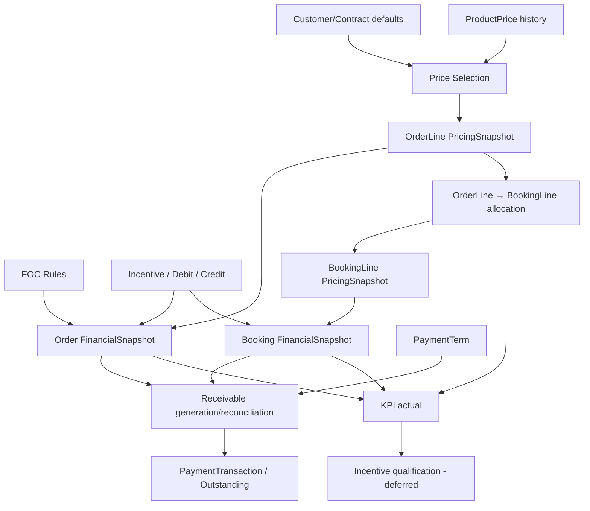

# 03 — Business Rules

## Hệ thống Quản lý Xuất khẩu KDQT (B2B Export Management System)

**Phiên bản:** 0.1  
**Trạng thái:** Draft for Business Review  
**Ngày cập nhật:** 2026-08-21  
**Baseline:** `docs/00-project-scope.md`  
**Canonical vocabulary:** `docs/01-domain-glossary.md`  
**Domain Model:** `docs/02-domain-model.md`  
**Nguồn nghiệp vụ:** workbook XLSX gốc, PPTX yêu cầu gốc, `phan_tich_chi_tiet_modules.md`, `website_modules_analysis.md` và các quyết định đã được baseline trong Project Scope / Domain Glossary / Domain Model.

> Tài liệu này khóa **business semantics, validation, calculation và eligibility rules** đủ căn cứ. Nó không khóa exact workflow transition matrix, permission matrix, SQL schema, API contract hoặc UI implementation.

---

# 1. Mục đích

`03-business-rules.md` trả lời các câu hỏi như:

- dữ liệu nào hợp lệ / không hợp lệ;
- master/default/override được resolve theo thứ tự nào;
- giá nào được dùng cho transaction;
- FOC, VAT, Incentive, Debit/Credit ảnh hưởng transaction value như thế nào;
- Order có thể phân bổ sang Booking như thế nào;
- Booking actual amount khác Order expected amount ở đâu;
- Batch, expiry, weight và fulfillment quantity được kiểm soát ra sao;
- Receivable, payment, overdue và due-soon được hiểu như thế nào;
- rule nào đã khóa, rule nào chỉ normalized, rule nào vẫn phải deferred.

Tài liệu **không biến assumption của tài liệu phân tích thứ cấp thành requirement** nếu XLSX/PPTX và baseline chưa xác nhận.

---

# 2. Thứ tự ưu tiên nguồn

Khi các nguồn khác nhau về wording hoặc mức chi tiết, áp dụng thứ tự:

1. Các quyết định đã merge trong `00-project-scope.md`, `01-domain-glossary.md`, `02-domain-model.md`.
2. Workbook XLSX nghiệp vụ gốc.
3. PPTX yêu cầu nghiệp vụ gốc.
4. `phan_tich_chi_tiet_modules.md` và `website_modules_analysis.md` như tài liệu phân tích/tham chiếu.

Nếu nguồn cấp thấp hơn mở rộng hoặc mâu thuẫn với nguồn cao hơn, rule không được tự khóa; phải đánh dấu `NORMALIZED` hoặc `DEFERRED`.

---

# 3. Trạng thái rule

| Status | Ý nghĩa |
|---|---|
| `LOCKED` | Có đủ căn cứ từ source gốc hoặc baseline đã merge; có thể dùng làm input cho Workflow/Data Dictionary/API. |
| `NORMALIZED` | Ý định nghiệp vụ tương đối rõ nhưng source wording/formula không nhất quán; canonical rule được đề xuất và cần business review trước implementation. |
| `DEFERRED` | Chưa đủ nguồn để quyết định; không được tự implement một interpretation duy nhất. |

`LOCKED` không có nghĩa là mọi chi tiết kỹ thuật đã khóa. Ví dụ business effect có thể khóa nhưng decimal precision, DB type hoặc rounding mode vẫn thuộc Data Dictionary.

---

# 4. Source traceability shorthand

Các rule dùng shorthand sau:

```text
DM    = docs/02-domain-model.md
GL    = docs/01-domain-glossary.md
SCOPE = docs/00-project-scope.md
XLSX:CUS = THÔNG TIN KHÁCH HÀNG
XLSX:PRO = THÔNG TIN HÀNG HÓA
XLSX:ORD = TẠO ĐƠN HÀNG
XLSX:BKG = TẠO BOOKING
XLSX:OPS = VẬN HÀNH
XLSX:COST = CHI PHÍ
XLSX:DEL = Lịch giao hàng
XLSX:REC = Theo dõi thanh toán
PPTX:n = slide n
PTCT = phan_tich_chi_tiet_modules.md
```

---

# 5. Cross-domain invariants

| ID | Status | Rule | Source |
|---|---|---|---|
| BR-GEN-001 | LOCKED | `CustomerCode`, `ProductionCode`, `OrderNumber`, `BookingCode` là business identifiers khác technical `Id`. | DM |
| BR-GEN-002 | LOCKED | `CustomerCode` global unique. | XLSX:CUS, DM |
| BR-GEN-003 | LOCKED | `ProductionCode` global unique. | XLSX:PRO, DM |
| BR-GEN-004 | LOCKED | `OrderNumber` global unique. | SCOPE, DM |
| BR-GEN-005 | LOCKED | `BookingCode` global unique. | SCOPE, DM |
| BR-GEN-006 | LOCKED | `ContractNumber` unique trong phạm vi Customer: `UNIQUE(CustomerId, ContractNumber)`. | DM |
| BR-GEN-007 | LOCKED | `BatchNumber` unique trong phạm vi Product: `UNIQUE(ProductId, BatchNumber)`. | DM |
| BR-GEN-008 | LOCKED | Master data thay đổi không được làm thay đổi transaction snapshot lịch sử đã chốt. | GL, DM |
| BR-GEN-009 | LOCKED | Order expected amount, Booking actual amount và Receivable AmountDue là ba business facts riêng, không được đồng nhất ngầm. | DM |
| BR-GEN-010 | LOCKED | Một business fact chỉ có một authoritative owner; màn hình/report ở domain khác chỉ đọc/derive hoặc snapshot có chủ đích. | DM |
| BR-GEN-011 | LOCKED | Customer Portal chỉ đọc dữ liệu thuộc Customer account hiện tại; Warehouse chỉ xử lý Booking thuộc Warehouse được phân; Finance Portal read-only. | SCOPE |
| BR-GEN-012 | LOCKED | Mọi create/update/import nghiệp vụ phải để lại audit trail theo phạm vi Audit capability. | PPTX:1, SCOPE |

---

# 6. Customer & Contract Rules

## 6.1. Customer identity và commercial defaults

| ID | Status | Rule | Source |
|---|---|---|---|
| BR-CUS-001 | LOCKED | Customer phải có `CustomerCode` không trùng toàn hệ thống. | XLSX:CUS B12, DM |
| BR-CUS-002 | DEFERRED | Cách sinh `CustomerCode` chưa khóa: workbook ghi nhập tay trong khi PTCT mô tả tự sinh từ tên viết tắt/mã nước. Implementation không được assume một mode duy nhất. | XLSX:CUS B12-B13, PTCT §1.3 |
| BR-CUS-003 | LOCKED | Customer giữ commercial defaults; Contract có thể override; Order snapshot resolved values thực tế. | DM C1-01 |
| BR-CUS-004 | LOCKED | Khi Order có Contract, Contract phải thuộc cùng Customer. | DM |
| BR-CUS-005 | LOCKED | Order có thể tồn tại với `ContractId = null`; Contract không phải invariant bắt buộc của Order aggregate. | DM |
| BR-CUS-006 | DEFERRED | Có bắt buộc Contract đang hiệu lực trước khi phát hành Order hay không chưa được source xác nhận. | DM Deferred |
| BR-CUS-007 | DEFERRED | Contract effective periods có được overlap cho cùng Customer hay không chưa khóa. | DM Deferred |

## 6.2. Contract display status / expiry alert

Workbook có công thức mô tả Contract Status không nhất quán dấu so sánh; PTCT thể hiện ý định cảnh báo 30 ngày hợp lý hơn. Vì vậy canonical formula dưới đây là `NORMALIZED`, chưa phải rule cuối cùng nếu business chưa xác nhận.

| ID | Status | Rule | Source |
|---|---|---|---|
| BR-CUS-010 | NORMALIZED | `Expired` khi `ExpiryDate < Today`. | XLSX:CUS B19; PTCT §1.4-1.5 |
| BR-CUS-011 | NORMALIZED | `ExpiringSoon` khi `Today <= ExpiryDate <= Today + 30 days`. | PTCT §1.4-1.5 |
| BR-CUS-012 | NORMALIZED | `Effective` khi `ExpiryDate > Today + 30 days`, nếu không có persisted lifecycle state khác. | PTCT §1.4-1.5 |
| BR-CUS-013 | LOCKED | `ExpiringSoon` là derived alert, không bắt buộc persisted lifecycle state. | GL, DM |
| BR-CUS-014 | DEFERRED | Time zone/calendar boundary dùng cho `Today` thuộc Architecture/Data Dictionary; không khóa trong tài liệu này. | — |

## 6.3. Currency, language và commercial terms

| ID | Status | Rule | Source |
|---|---|---|---|
| BR-CUS-020 | LOCKED | Nếu transaction Currency là `VND`, generated document dùng nội dung tiếng Việt và giá VND theo source convention. | XLSX:CUS B33; PTCT §1.5 |
| BR-CUS-021 | LOCKED | Nếu transaction Currency là `USD`, generated document dùng nội dung tiếng Anh và giá USD theo source convention. | XLSX:CUS B33; PTCT §1.5 |
| BR-CUS-022 | LOCKED | Document generation phải dùng Currency/CommercialSnapshot của transaction, không đọc động Customer hiện tại để đổi ngôn ngữ/đồng tiền cho transaction cũ. | DM snapshot principle |
| BR-CUS-023 | LOCKED | Incoterm canonical hiện hỗ trợ tối thiểu `EXW`, `FOB`, `DAT`; không tự đổi `DAT` sang thuật ngữ khác. | XLSX:CUS B39; GL |
| BR-CUS-024 | LOCKED | PaymentTerm là rule/input; concrete `DueDate` thuộc Receivable. | GL, DM |
| BR-CUS-025 | DEFERRED | `Bank Fee` calculation/effect chưa đủ source để đưa vào FinalAmount formula. | XLSX:CUS B41, DM |

## 6.4. Document requirement resolution

| ID | Status | Rule | Source |
|---|---|---|---|
| BR-CUS-030 | LOCKED | Customer sở hữu default document requirements. | XLSX:CUS B35, DM |
| BR-CUS-031 | LOCKED | Contract có thể Add/Remove từng DocumentType so với Customer defaults. | DM |
| BR-CUS-032 | LOCKED | Effective document requirement set được resolve theo semantics: `CustomerDefaults + ContractAdds - ContractRemoves`. | DM |
| BR-CUS-033 | LOCKED | Khi Booking tạo transaction obligations, requirement phải được snapshot để thay đổi Customer/Contract sau đó không tự đổi obligations lịch sử. | DM DocumentObligation |
| BR-CUS-034 | NORMALIZED | Mốc tạo/snapshot `DocumentObligation` nên là khi Booking được `Published`, vì Customer Planning chỉ nhận Booking đã phát hành. Exact side-effect nằm trong Workflow. | PPTX:13, XLSX:BKG B54, DM |

---

# 7. Product & Pricing Rules

## 7.1. Product identifiers và catalog facts

| ID | Status | Rule | Source |
|---|---|---|---|
| BR-PRO-001 | LOCKED | `ProductionCode` là canonical Product business identifier; barcode chỉ là supplementary identifiers. | XLSX:PRO B3/B6-B8, GL, DM |
| BR-PRO-002 | DEFERRED | Barcode format/check-digit/global uniqueness chưa khóa. | DM Deferred |
| BR-PRO-003 | LOCKED | `ProductClass` khác `StorageCategory`; `StorageCategory` source values hiện có `Chill` và `Ambient`. | XLSX:PRO B4/B17, DM |
| BR-PRO-004 | LOCKED | `ProductGroup` và `Brand` chưa trở thành canonical master concepts chỉ vì reporting wording; taxonomy phải được business xác nhận trước. | DM |
| BR-PRO-005 | LOCKED | Ingredient List không overwrite history; dùng `ProductIngredientVersion`. | XLSX:PRO B38-B39, DM |

## 7.2. Effective-dated ProductPrice

| ID | Status | Rule | Source |
|---|---|---|---|
| BR-PRICE-001 | LOCKED | Base ProductPrice được phân biệt tối thiểu bởi Product + Incoterm + Currency + effective period. | XLSX:PRO B14-B15/B42-B44, GL, DM |
| BR-PRICE-002 | LOCKED | Giá mới không overwrite giá cũ; phải giữ effective-dated history. | XLSX:PRO B42-B44, DM |
| BR-PRICE-003 | LOCKED | `Current price` và `Upcoming price` là derived views từ effective dates; không tồn tại canonical `Price1/Price2` semantics trong domain. | DM |
| BR-PRICE-004 | LOCKED | Legacy source `FOB/DAT` map về hai canonical price contexts `FOB` và `DAT`; không tạo Incoterm `FOB_DAT`. | DM C2-11 |
| BR-PRICE-005 | LOCKED | Khi chốt giá cho OrderLine, candidate price phải match Product, resolved Order Incoterm và resolved Order Currency. | XLSX:PRO, XLSX:ORD, DM |
| BR-PRICE-006 | LOCKED | Giá đã chốt vào `OrderLine.PricingSnapshot` không thay đổi tự động khi ProductPrice master thay đổi sau đó. | GL, DM |
| BR-PRICE-007 | DEFERRED | Business date dùng để chọn effective ProductPrice chưa được source xác nhận rõ: OrderDate, create timestamp hay publish timestamp. | DM Deferred |
| BR-PRICE-008 | DEFERRED | Rule khi có 0 candidate price hoặc >1 overlapping effective price chưa khóa; không được tự chọn “latest wins”. | DM Deferred |
| BR-PRICE-009 | DEFERRED | Overlap có bị cấm cho cùng Product+Incoterm+Currency hay không chưa khóa. | DM Deferred |
| BR-PRICE-010 | LOCKED | Không thêm canonical `PriceBasis = EA/Carton` chỉ từ PTCT; XLSX/PPTX gốc chưa xác nhận ProductPrice có hai price bases này. | DM review note |

## 7.3. VAT

| ID | Status | Rule | Source |
|---|---|---|---|
| BR-PRICE-020 | LOCKED | Với transaction Currency `VND`, VAT áp dụng lấy từ Product VAT snapshot tại transaction. | XLSX:PRO B41 |
| BR-PRICE-021 | LOCKED | Với transaction Currency `USD`, VAT source convention mặc định bằng `0`. | XLSX:PRO B41 |
| BR-PRICE-022 | LOCKED | VAT applied value phải snapshot trên transaction line; Product VAT thay đổi sau này không làm đổi line cũ. | DM |
| BR-PRICE-023 | DEFERRED | Decimal precision, rounding mode và thời điểm rounding VAT chưa khóa. | DM Deferred |

## 7.4. Packing / physical calculation source rules

| ID | Status | Rule | Source |
|---|---|---|---|
| BR-PRO-020 | LOCKED | Nếu Packing/Unit = `EA`, Packing List dùng unit-level net/gross weight và unit dimensions. | XLSX:PRO B20-B24 |
| BR-PRO-021 | LOCKED | Nếu Packing/Unit = `Carton`, Packing List dùng carton-level net/gross weight, dimensions và CBM. | XLSX:PRO B26-B31 |
| BR-PRO-022 | DEFERRED | Pallet-based Packing List weight/CBM calculation chưa có công thức đủ rõ. | XLSX:ORD B13-B15; XLSX:PRO |

---

# 8. Order Rules

## 8.1. Order creation / eligibility

| ID | Status | Rule | Source |
|---|---|---|---|
| BR-ORD-001 | LOCKED | Order luôn thuộc một Customer. | DM |
| BR-ORD-002 | LOCKED | Order chứa một hoặc nhiều OrderLine khi đạt business state yêu cầu lines; draft validation exact timing thuộc Workflow. | DM |
| BR-ORD-003 | LOCKED | Order commercial data được resolve từ Customer defaults + optional Contract overrides rồi snapshot. | XLSX:ORD B5-B6; DM |
| BR-ORD-004 | LOCKED | Order line Product phải reference Product master hiện hữu tại thời điểm chọn. | XLSX:ORD B12, DM |
| BR-ORD-005 | LOCKED | OrderLine quantity phải là giá trị dương cho line hàng có quantity; zero/negative quantity không phải source-supported normal order line. | XLSX:ORD B14 |
| BR-ORD-006 | LOCKED | Chỉ Order đã `Published` mới là nguồn để tạo Booking theo source; exact state transition thuộc Workflow. | XLSX:BKG B6-B8; PTCT §4.3 |
| BR-ORD-007 | LOCKED | OrderLine được đánh dấu fulfillment complete thì không còn eligible để chọn cho Booking mới. | PPTX:6, XLSX:BKG B26/B49 |

## 8.2. Order number

| ID | Status | Rule | Source |
|---|---|---|---|
| BR-ORD-010 | LOCKED | Hệ thống gợi ý/sinh `OrderNumber` theo pattern source dạng `Customer/Country-Year-Sequence`, ví dụ `VILAXIM/RUS&EU-2026-011`. | XLSX:ORD B3; PTCT §3.4 |
| BR-ORD-011 | DEFERRED | Exact canonical format, separator escaping, sequence reset, padding, concurrency và manual override chưa khóa. | DM Deferred |
| BR-ORD-012 | LOCKED | Dù format thay đổi, `OrderNumber` vẫn phải global unique. | DM |

## 8.3. Transaction line price components

Source Order xác nhận các inputs: quantity, discount %, label fee %, other fee %, tax, FOC; PTCT đưa công thức tổng quát nhưng workbook không đủ rõ về base/sequence của từng percentage. Vì vậy chỉ khóa **direction/semantics**, chưa khóa full arithmetic sequence.

| ID | Status | Rule | Source |
|---|---|---|---|
| BR-ORD-020 | LOCKED | `BaseLineValue` business concept bắt đầu từ selected unit price × chargeable quantity. | XLSX:ORD B19-B22; PTCT §3.4 |
| BR-ORD-021 | LOCKED | Discount là subtractive price adjustment. | XLSX:ORD B16; PTCT |
| BR-ORD-022 | LOCKED | Label fee và Other fee là additive commercial inputs theo source intent. | XLSX:ORD B17-B18; PTCT |
| BR-ORD-023 | DEFERRED | Base dùng để tính Discount/LabelFee/OtherFee percentage, thứ tự áp dụng và compounding chưa đủ source để khóa. | XLSX:ORD B16-B18 |
| BR-ORD-024 | LOCKED | VAT effect áp dụng theo BR-PRICE-020/021 và snapshot VAT của line. | XLSX:ORD B20-B22 |
| BR-ORD-025 | DEFERRED | Money precision/rounding cho line totals chưa khóa. | DM Deferred |

## 8.4. FOC rules

Workbook Order/Booking mô tả một input “FOC số mấy” và ví dụ 24 thùng, FOC 12 → phần nguyên của `24/12`.

| ID | Status | Rule | Source |
|---|---|---|---|
| BR-FOC-001 | LOCKED | FOC là physical quantity được giao miễn phí và không làm tăng payable amount. | XLSX:ORD B12/B23; PTCT §3.4 |
| BR-FOC-002 | LOCKED | Khi dùng source FOC interval `N`, `N` phải > 0. | XLSX:ORD D12 |
| BR-FOC-003 | LOCKED | Source FOC quantity formula: `FocQuantity = floor(BaseOrderedQuantity / N)`. | XLSX:ORD D12/E12; XLSX:BKG D26/E26 |
| BR-FOC-004 | LOCKED | FOC quantity phải được theo dõi như physical fulfillment quantity, dù payable value bằng 0. | XLSX:ORD/BKG, DM |
| BR-FOC-005 | NORMALIZED | Canonical financial effect là loại FOC value khỏi payable amount; implementation không được vừa zero-value FOC vừa trừ thêm cùng value lần thứ hai. | XLSX:ORD B23; DM snapshot model |
| BR-FOC-006 | DEFERRED | FOC có tính vào KPI quantity/value, incentive threshold hoặc freight allocation hay không chưa khóa. | DM Deferred |

## 8.5. Incentive / Debit / Credit / Other adjustments

| ID | Status | Rule | Source |
|---|---|---|---|
| BR-ADJ-001 | LOCKED | `IncentiveProgram` là policy; `AppliedIncentive` là transaction fact; không đồng nhất hai concept. | DM |
| BR-ADJ-002 | LOCKED | Source Order/Booking cho phép Quarter Incentive và Year Incentive được nhập/applied ở transaction. | XLSX:ORD B24-B25; XLSX:BKG B37-B38 |
| BR-ADJ-003 | LOCKED | Applied Quarter/Year Incentive có business effect **subtractive** lên FinalAmount theo source convention. | XLSX:ORD C24-C25 |
| BR-ADJ-004 | LOCKED | Debit Note có business effect **subtractive** theo workbook source convention. | XLSX:ORD B26-C26; GL |
| BR-ADJ-005 | LOCKED | Credit Note có business effect **additive** theo workbook source convention. | XLSX:ORD B27-C27; GL |
| BR-ADJ-006 | LOCKED | Không đảo Debit/Credit effect theo kiến thức kế toán chung nếu chưa có business decision thay đổi source convention. | GL |
| BR-ADJ-007 | DEFERRED | `Other` adjustment là additive/subtractive/2 chiều thế nào chưa được source khóa. | XLSX:ORD B28 |
| BR-ADJ-008 | DEFERRED | Incentive tier threshold/reward/unit/automatic eligibility chưa khóa; không tự derive incentive từ 3 tier fields. | XLSX:CUS B22-B27; DM |
| BR-ADJ-009 | LOCKED | Ở source hiện tại AppliedIncentive được nhập tay ở Order/Booking; hệ thống không được mặc định auto-apply tier program khi chưa có rule. | XLSX:ORD/BKG |

## 8.6. Order financial result

| ID | Status | Rule | Source |
|---|---|---|---|
| BR-ORD-FIN-001 | LOCKED | `Order.FinancialSnapshot.FinalAmount` là expected/issued Order amount, khác Booking actual amount. | XLSX:ORD B29; DM |
| BR-ORD-FIN-002 | NORMALIZED | FinalAmount phải phản ánh tổng chargeable line amounts sau VAT + applied transaction adjustments theo business directions đã khóa ở trên. | XLSX:ORD B19-B29; DM |
| BR-ORD-FIN-003 | DEFERRED | Exact algebra/rounding sequence cho Discount/fees/VAT/Incentive/Debit/Credit/Other chưa đủ source để khóa hoàn toàn. | XLSX:ORD |
| BR-ORD-FIN-004 | LOCKED | Sau khi Order financial snapshot được chốt, master price/VAT/customer commercial default thay đổi không rewrite historical FinalAmount. | DM |
| BR-ORD-FIN-005 | DEFERRED | Exact milestone “financial snapshot becomes final” thuộc Workflow; source chỉ gắn việc tổng hợp payment khi Order được Published. | XLSX:ORD B30/B34 |

---

# 9. Order → Booking Fulfillment Rules

## 9.1. Eligibility và split

| ID | Status | Rule | Source |
|---|---|---|---|
| BR-BKG-001 | LOCKED | Một Order có thể split thành nhiều Booking. | XLSX:BKG, SCOPE, DM |
| BR-BKG-002 | LOCKED | Không khóa số Booking tối đa cho một Order; source secondary vẫn ghi đây là câu hỏi mở. | PTCT Open Question #1; DM |
| BR-BKG-003 | LOCKED | BookingLine bắt buộc trace về một OrderLine. | DM |
| BR-BKG-004 | LOCKED | Product của BookingLine được derive qua OrderLine; không persist duplicate ProductId như authoritative fact. | DM |
| BR-BKG-005 | LOCKED | Booking selector chỉ hiển thị OrderLine chưa hoàn thành/eligible và quantity còn có thể fulfill. | XLSX:BKG B26/B49; PPTX:7 |

## 9.2. Remaining quantity / over-allocation

| ID | Status | Rule | Source |
|---|---|---|---|
| BR-BKG-010 | LOCKED | Hệ thống phải ngăn Booking allocation vượt quá quantity OrderLine còn được phép fulfill. | XLSX:BKG B26, DM |
| BR-BKG-011 | NORMALIZED | `RemainingQuantity = Ordered/FulfillableQuantity - CommittedQuantity`, trong đó CommittedQuantity là tổng BookingLine quantities còn tiêu thụ fulfillment. | XLSX:BKG B26; DM |
| BR-BKG-012 | DEFERRED | Booking states nào “còn tiêu thụ fulfillment” (Published/Hold/InTransit/Cancelled...) thuộc Workflow; không hard-code ở đây. | DM Deferred |
| BR-BKG-013 | DEFERRED | Cách FOC quantity tham gia `RemainingQuantity` khi FOC được phát sinh/điều chỉnh nhiều Booking cần rule chi tiết hơn nếu business cho phép. | DM Deferred |
| BR-BKG-014 | LOCKED | Mark OrderLine complete loại line khỏi Booking selection tiếp theo; không đồng nghĩa tự xóa historical BookingLines. | PPTX:6-7, DM |

## 9.3. Booking pricing snapshot

| ID | Status | Rule | Source |
|---|---|---|---|
| BR-BKG-020 | LOCKED | BookingLine snapshot pricing từ OrderLine cho quantity được booked để Booking history không phụ thuộc amendment master sau đó. | DM |
| BR-BKG-021 | LOCKED | Booking pricing snapshot dùng transaction values của OrderLine làm starting point; không tự re-select current ProductPrice master khi tạo Booking. | DM snapshot principle |
| BR-BKG-022 | DEFERRED | Nếu OrderLine được amend sau khi Booking đã snapshot, rule cho Booking chưa publish/published phải được khóa ở Workflow/Business Rules amendment section sau. | — |

---

# 10. Booking Financial Rules

| ID | Status | Rule | Source |
|---|---|---|---|
| BR-BKG-FIN-001 | LOCKED | Booking có financial inputs tương tự transaction line/adjustments và có `FINAL AMOUNT`. | XLSX:BKG B29-B42 |
| BR-BKG-FIN-002 | LOCKED | `Booking.FinancialSnapshot.FinalAmount` là actual fulfilled Booking amount và khác `Order.FinancialSnapshot.FinalAmount`. | XLSX:BKG B42; XLSX:REC B10; DM |
| BR-BKG-FIN-003 | LOCKED | Payment tracking chỉ coi Booking amount là “Số tiền thực tế” sau khi Booking đã giao/fulfilled theo source. | XLSX:REC B10; PTCT §8.3 |
| BR-BKG-FIN-004 | LOCKED | Booking-specific Incentive/Debit/Credit áp dụng theo cùng business direction của BR-ADJ-003..005. | XLSX:BKG B37-B40 |
| BR-BKG-FIN-005 | DEFERRED | Allocation của Order-level Incentive/FinancialAdjustment khi Order split nhiều Booking chưa khóa; không tự pro-rata. | DM Deferred |
| BR-BKG-FIN-006 | DEFERRED | Exact Booking FinalAmount formula/rounding/finalization milestone chưa khóa. | DM Deferred |
| BR-BKG-FIN-007 | LOCKED | Booking actual amount không tự overwrite Order expected amount; hai snapshots phải được bảo toàn riêng. | DM |

---

# 11. Batch, Expiry, Weight & Warehouse Rules

## 11.1. Batch allocation

| ID | Status | Rule | Source |
|---|---|---|---|
| BR-BAT-001 | LOCKED | Batch thuộc Product; BookingLine sử dụng Batch thông qua BatchAllocation. | DM |
| BR-BAT-002 | LOCKED | Batch được gán cho BookingLine phải thuộc cùng Product mà BookingLine trace qua OrderLine. | DM invariant |
| BR-BAT-003 | LOCKED | Tổng BatchAllocation.Quantity của một BookingLine không được vượt BookedQuantity. | DM quantity ownership |
| BR-BAT-004 | LOCKED | Một BookingLine có thể dùng nhiều Batch và một Batch có thể phục vụ nhiều BookingLine theo Domain Model. | DM |
| BR-BAT-005 | LOCKED | Warehouse chỉ được cập nhật batch cho Booking thuộc Warehouse data scope của account. | SCOPE |
| BR-BAT-006 | DEFERRED | Batch completion status exact meaning (đủ số batch, đủ quantity, QA complete...) chưa khóa. | PPTX:19; XLSX:BKG |

## 11.2. Production / expiry date

| ID | Status | Rule | Source |
|---|---|---|---|
| BR-BAT-010 | LOCKED | Booking production date được lấy/derive từ Batch data theo source. | XLSX:BKG B43-B44 |
| BR-BAT-011 | LOCKED | Expiry date được derive từ ProductionDate + Product ShelfLifeDays. | XLSX:BKG B45; XLSX:PRO B16 |
| BR-BAT-012 | DEFERRED | Inclusive/exclusive day arithmetic và timezone cho expiry thuộc Data Dictionary/Business confirmation nếu có yêu cầu pháp lý. | — |

## 11.3. Weight / volume

| ID | Status | Rule | Source |
|---|---|---|---|
| BR-BAT-020 | NORMALIZED | Nếu BookingLine UOM = EA, net/gross total có thể derive `Quantity × Product unit net/gross weight`. | XLSX:PRO B20-B21; XLSX:BKG B47-B48 |
| BR-BAT-021 | NORMALIZED | Nếu BookingLine UOM = Carton, net/gross total có thể derive `Quantity × Product carton net/gross weight`. | XLSX:PRO B26-B27; XLSX:BKG B47-B48 |
| BR-BAT-022 | DEFERRED | Pallet weight/volume formula và mixed-UOM conversion chưa đủ source để khóa. | XLSX:PRO, XLSX:BKG |

---

# 12. Logistics / Delivery Business Rules

Các exact state transitions nằm trong `04-workflow-state-machines.md`; section này chỉ khóa business effects đủ nguồn.

| ID | Status | Rule | Source |
|---|---|---|---|
| BR-LOG-001 | LOCKED | Một Booking có một primary Warehouse. | DM |
| BR-LOG-002 | LOCKED | Nếu một Order cần fulfill từ nhiều Warehouse, dùng nhiều Booking thay vì nhiều primary Warehouse trong một Booking. | DM |
| BR-LOG-003 | LOCKED | `LCL` là load type, không phải EquipmentType. | GL, DM |
| BR-LOG-004 | LOCKED | ETD, ATD, ETA, ATA là các facts khác nhau; không đồng nhất ETD với LoadingDate. | GL, DM |
| BR-LOG-005 | LOCKED | Khi Booking chuyển sang “Đang giao”, Booking không còn hiển thị trong active Delivery Schedule list theo source; history không bị xóa. | XLSX:DEL B3-B19; PTCT §7.4 |
| BR-LOG-006 | LOCKED | Warehouse action “Đã giao hàng” có source side effect cập nhật Booking sang “Đang giao” và Delivery Schedule; exact actor/transition guard thuộc Workflow. | PPTX:20; PTCT §7.4 |
| BR-LOG-007 | DEFERRED | Ai có quyền trực tiếp chuyển Booking sang “Đang giao” vẫn là workflow/permission question; không khóa trong Business Rules. | PTCT Open Question #2 |

---

# 13. Operations Rules

| ID | Status | Rule | Source |
|---|---|---|---|
| BR-OPS-001 | LOCKED | WorkItem là work/task riêng gắn Booking, có Primary PIC, Deadline và Status. | SCOPE, DM |
| BR-OPS-002 | LOCKED | `IsOverdue` là derived: deadline đã qua và WorkItem chưa ở trạng thái completion-equivalent. Exact completion states thuộc Workflow. | PTCT §5, DM |
| BR-OPS-003 | LOCKED | Dashboard PIC ratios là derived/reporting data, không phải authoritative fields phải nhập tay. | PPTX:8, DM |
| BR-OPS-004 | LOCKED | CO Submit Date chỉ hợp lệ sau khi có Customs Clearance Number theo workbook note. | XLSX:OPS B35-B42 |
| BR-OPS-005 | LOCKED | ETD/ATD/ETA/ATA, container/seal/driver và document facts phải đọc từ authoritative Logistics/Documents ownership thay vì duplicate editable facts trong Operations. | XLSX:OPS, DM |
| BR-OPS-006 | DEFERRED | `Docs sent (N+3)` chưa khóa vì source không định nghĩa rõ `N`/calendar-day semantics. | XLSX:OPS B51 |
| BR-OPS-007 | DEFERRED | `Release Time` linked từ payment khi “đã hoàn thành” chưa đủ semantics để xác định exact condition. | XLSX:OPS B50 |

---

# 14. Document Rules

| ID | Status | Rule | Source |
|---|---|---|---|
| BR-DOC-001 | LOCKED | Order generation candidates: Purchase Order, Proforma Invoice, Quotation. | PPTX:6, GL, DM |
| BR-DOC-002 | LOCKED | Booking generation candidates: Commercial Invoice/IV, Packing List, Batch Information. | PPTX:7, XLSX:BKG, GL, DM |
| BR-DOC-003 | LOCKED | BL, Customs Declaration/TKHQ, CO, HC và external certificates mặc định là external/uploaded/tracked nếu source không xác nhận system generation. | GL, DM |
| BR-DOC-004 | LOCKED | Generated document phải dùng transaction snapshot, không đọc current master values làm thay đổi historical representation. | DM |
| BR-DOC-005 | LOCKED | Generated revision phải giữ TemplateVersion đã dùng; template update không rewrite revision cũ. | DM |
| BR-DOC-006 | LOCKED | BusinessDocument phải có ít nhất một direct subject Customer/Order/Booking. | DM |
| BR-DOC-007 | LOCKED | CustomerId không được thêm chỉ để duplicate Customer derive từ Order/Booking nếu Customer không phải direct subject. | DM |
| BR-DOC-008 | LOCKED | Customer Planning hiển thị document obligations/fulfillment của Booking thuộc Customer đó. | PPTX:13; PTCT §KH-2 |
| BR-DOC-009 | DEFERRED | Exact document approval/status/version workflow thuộc `04-workflow-state-machines.md`. | DM Deferred |
| BR-DOC-010 | DEFERRED | Exact HC subtype taxonomy và template mapping chưa khóa. | GL, DM |

---

# 15. Cost Rules

Workbook Cost chứa nhiều loại cost hơn danh sách tóm tắt 24 loại; Domain Model đã chuẩn hóa bằng configurable `CostType` + `CostItem` thay vì fixed columns.

| ID | Status | Rule | Source |
|---|---|---|---|
| BR-COST-001 | LOCKED | Chi phí được quản lý theo Booking. | XLSX:COST B3-B5; DM |
| BR-COST-002 | LOCKED | Một Booking có tối đa một `BookingCostStatement` aggregate trong current Domain Model. | DM |
| BR-COST-003 | LOCKED | Các loại phí dùng `CostType` configurable; không hard-code 24/50 columns làm domain schema. | XLSX:COST; DM |
| BR-COST-004 | LOCKED | CostItem có thể reference Vendor; source có VendorCode/VendorName. | XLSX:COST row 6; DM |
| BR-COST-005 | LOCKED | Finance đọc cost đã được KDQT nhập/phát hành; Finance Portal không trở thành source-of-truth cập nhật cost. | PPTX:22, SCOPE |
| BR-COST-006 | LOCKED | Cost reporting theo Customer/Month là derived từ Booking cost data. | PPTX:9; PTCT §6 |
| BR-COST-007 | DEFERRED | Universal formula cho UnitPrice × Quantity × ExchangeRate × VAT chưa thể khóa từ workbook vì formula/header examples không nhất quán đầy đủ. | XLSX:COST |
| BR-COST-008 | DEFERRED | Exchange-rate source/date, currency conversion direction, rounding và approval rules chưa khóa. | DM Deferred |
| BR-COST-009 | DEFERRED | Semantics của `TH Payment` và `TH's Payment be on half` cần business clarification trước khi canonicalize. | XLSX:COST row 6/55 |
| BR-COST-010 | DEFERRED | Cost lifecycle exact states/transitions thuộc Workflow. | DM Deferred |

---

# 16. Receivable & Payment Rules

## 16.1. Preserve distinct amounts

| ID | Status | Rule | Source |
|---|---|---|---|
| BR-REC-001 | LOCKED | `Order.FinancialSnapshot.FinalAmount` là source semantic của “Số tiền cần thanh toán” ở Order/payment tracking view. | XLSX:ORD B29; XLSX:REC B8; DM |
| BR-REC-002 | LOCKED | `Booking.FinancialSnapshot.FinalAmount` là source semantic của “Số tiền thực tế” sau Booking fulfillment/delivery. | XLSX:BKG B42; XLSX:REC B10; DM |
| BR-REC-003 | LOCKED | `Receivable.AmountDue` là business fact riêng; không tự gán bằng Order FinalAmount hoặc Booking FinalAmount nếu rule generation/reconciliation chưa được xác nhận. | DM F5 resolution |
| BR-REC-004 | DEFERRED | Receivable generation cardinality (per Order, per Booking hoặc kết hợp) chưa khóa. | GL, DM Deferred |
| BR-REC-005 | DEFERRED | Mapping/reconciliation Order expected ↔ Booking actual(s) ↔ Receivable AmountDue chưa khóa. | DM Deferred |

## 16.2. Due date

| ID | Status | Rule | Source |
|---|---|---|---|
| BR-REC-010 | LOCKED | `DueDate` authoritative trên Receivable. | GL, DM |
| BR-REC-011 | LOCKED | PaymentTerm là input/rule dùng để xác định DueDate; source Order có “Ngày cần thanh toán / ngày dự kiến thanh toán”. | XLSX:ORD B30; XLSX:REC B9; GL |
| BR-REC-012 | DEFERRED | Mốc tham chiếu PaymentTerm (OrderDate/InvoiceDate/BL/Delivery/etc.) chưa khóa. | DM Deferred |
| BR-REC-013 | DEFERRED | Nếu Order nhập explicit expected payment date, exact precedence so với PaymentTerm-derived DueDate chưa khóa. | XLSX:ORD B30 |

## 16.3. Payments / outstanding

| ID | Status | Rule | Source |
|---|---|---|---|
| BR-REC-020 | LOCKED | Một Receivable hỗ trợ nhiều PaymentTransactions / partial payment. | SCOPE, DM |
| BR-REC-021 | LOCKED | `AmountPaid = sum(applied PaymentTransaction amounts)` trong cùng monetary basis; FX/refund exceptions deferred. | DM |
| BR-REC-022 | LOCKED | `OutstandingBalance = AmountDue - applicable paid amount` ở base case; adjustments phải được áp dụng một lần theo receivable rule, không double-count. | DM |
| BR-REC-023 | DEFERRED | Overpayment, refund, chargeback và cross-currency payment rules chưa khóa. | DM Deferred |
| BR-REC-024 | LOCKED | Payment Schedule/“unpaid” views chỉ hiển thị obligations còn outstanding theo business payment status. | PPTX:16, SCOPE |

## 16.4. Overdue / due soon

| ID | Status | Rule | Source |
|---|---|---|---|
| BR-REC-030 | LOCKED | `OverdueDays = max(0, Today - DueDate)` cho obligation còn outstanding. | XLSX:REC B11; PTCT §8.3 |
| BR-REC-031 | LOCKED | `Overdue` khi obligation còn outstanding và `Today > DueDate`. | XLSX:REC B11-B12 |
| BR-REC-032 | NORMALIZED | `DueSoon` khi obligation còn outstanding, chưa overdue và `0 <= DueDate - Today <= DueSoonThresholdDays`. | XLSX:REC B12; PTCT |
| BR-REC-033 | DEFERRED | `DueSoonThresholdDays` chưa khóa; PTCT ghi 7 ngày chỉ là giả định cần hỏi khách hàng. | PTCT Open Question #6 |
| BR-REC-034 | LOCKED | Khi không overdue và không due-soon, payment timing status là `WithinDue/Trong hạn` theo source semantics. | XLSX:REC B12 |

---

# 17. KPI & Incentive Rules

## 17.1. KPI targets

| ID | Status | Rule | Source |
|---|---|---|---|
| BR-KPI-001 | LOCKED | Source Customer có Quantity KPI targets Q1-Q4 và Year. | XLSX:CUS B28-B32 |
| BR-KPI-002 | LOCKED | KPI target thuộc Customer + period; Domain Model hỗ trợ Metric extensible. | DM |
| BR-KPI-003 | LOCKED | `SalesValue` target support là approved Domain Model clarification, không phải fact trực tiếp từ workbook KPI target columns. | DM C1-10 |
| BR-KPI-004 | LOCKED | Customer Portal KPI hiển thị tổng quantity và total value theo month/quarter/year so với target. | PPTX:17; PTCT §KH-6 |
| BR-KPI-005 | DEFERRED | “Actual Quantity” dùng OrderedQuantity hay Fulfilled/Delivered Booking quantity chưa được source khóa. | PTCT §KH-6, DM Deferred |
| BR-KPI-006 | DEFERRED | “Actual SalesValue” dùng Order expected value hay Booking actual value chưa được source khóa. | PTCT §KH-6, DM Deferred |
| BR-KPI-007 | DEFERRED | Period attribution date (OrderDate/BookingDate/DeliveryDate) chưa khóa. | DM Deferred |
| BR-KPI-008 | DEFERRED | FOC/cancelled quantity có tính vào KPI không chưa khóa. | DM Deferred |
| BR-KPI-009 | DEFERRED | Multi-currency SalesValue KPI cần conversion basis/rate nếu tổng hợp chung; source chưa định nghĩa. | DM Deferred |

## 17.2. Incentive programs

| ID | Status | Rule | Source |
|---|---|---|---|
| BR-INC-001 | LOCKED | Source hiện có Quarter Incentive 3 mức và Year Incentive 3 mức. | XLSX:CUS B22-B27 |
| BR-INC-002 | LOCKED | Domain không hard-code 3 columns; dùng IncentiveProgram + ordered IncentiveTiers. | DM |
| BR-INC-003 | DEFERRED | Threshold, reward amount/rate, metric basis và tier qualification chưa khóa. | DM Deferred |
| BR-INC-004 | DEFERRED | Tự động tính/apply Incentive từ KPI attainment chưa được source xác nhận; current transaction source cho phép nhập AppliedIncentive thủ công. | XLSX:ORD/BKG |

## 17.3. “Market share” / sales mix

| ID | Status | Rule | Source |
|---|---|---|---|
| BR-KPI-020 | DEFERRED | Source dùng từ “thị phần theo khách hàng/theo nước” nhưng không cung cấp external total-market denominator; không được tự gọi internal sales mix là true market share nếu chưa xác nhận. | PPTX:3; PTCT §1.2 |

---

# 18. Import / Update / Duplicate Rules

| ID | Status | Rule | Source |
|---|---|---|---|
| BR-IMP-001 | LOCKED | Customer và Product hỗ trợ Excel import theo template. | PPTX:3-4; SCOPE |
| BR-IMP-002 | LOCKED | Import phải validate trước khi ghi dữ liệu và trả error report cho invalid rows. | PTCT; SCOPE |
| BR-IMP-003 | LOCKED | Import hỗ trợ create + update bằng business key; valid rows có thể thành công dù file có invalid rows (partial success). | SCOPE |
| BR-IMP-004 | LOCKED | Customer import business key là CustomerCode; Product import business key là ProductionCode. | DM |
| BR-IMP-005 | NORMALIZED | Hai rows trong cùng import batch có cùng business key nên được coi là conflict/error để tránh kết quả update phụ thuộc row order. | “no duplicate data” requirement + deterministic import design |
| BR-IMP-006 | LOCKED | Update master data qua import không rewrite historical transaction snapshots. | DM snapshot principle |
| BR-IMP-007 | LOCKED | Import mutations phải tham gia audit trail tương tự manual CRUD. | PPTX:1; SCOPE |
| BR-IMP-008 | DEFERRED | Hard delete/soft delete/archive semantics cho Customer/Product chưa khóa dù PPTX có yêu cầu thêm/bớt/xóa dữ liệu tổng quát. | PPTX:1 |

---

# 19. Derived views / reporting rules

| ID | Status | Rule | Source |
|---|---|---|---|
| BR-VIEW-001 | LOCKED | Current/Upcoming ProductPrice là derived từ effective date; không cần duplicate “current/upcoming flag” làm source-of-truth. | DM |
| BR-VIEW-002 | LOCKED | Contract ExpiringSoon là derived từ dates/threshold. | GL, DM |
| BR-VIEW-003 | LOCKED | WorkItem IsOverdue và PIC on-time ratios là derived. | DM |
| BR-VIEW-004 | LOCKED | Payment AmountPaid/OutstandingBalance/OverdueDays/timing category là derived từ Receivable + PaymentTransactions + DueDate. | DM |
| BR-VIEW-005 | LOCKED | Customer Portal Planning/OnTheWay/Completed là projections từ Booking lifecycle; portal không sở hữu duplicate status. | SCOPE, DM |
| BR-VIEW-006 | LOCKED | Delivery Schedule active list loại Booking khi Booking đạt “Đang giao”, nhưng record/history vẫn tồn tại. | XLSX:DEL |
| BR-VIEW-007 | LOCKED | Warehouse list không hiển thị price; Finance order information có quantity + price theo scope. | PPTX:18/21, SCOPE |

---

# 20. Source conflicts / ambiguities intentionally preserved

Các điểm dưới đây **không được coi là bug của tài liệu**. Đây là những chỗ source chưa đủ để khóa rule cuối cùng.

| Topic | Source conflict / gap | Treatment |
|---|---|---|
| CustomerCode generation | XLSX ghi nhập tay; PTCT nói tự sinh | Unique locked; generation deferred. |
| Contract Status formula | Workbook dấu so sánh không hợp lý; PTCT mô tả 30-day alert hợp lý hơn | Canonical formula marked NORMALIZED. |
| Order lifecycle | PPTX dùng `Tạo mới/Phát hành/Hoàn thành` và chỗ khác `Đã thanh toán` | Exact states chuyển sang Workflow. |
| Booking lifecycle | PPTX/XLSX và PTCT không hoàn toàn giống nhau về `Ongoing` | Exact state machine chuyển sang Workflow. |
| Product price basis | PTCT nói EA/Carton price selection; XLSX gốc chỉ rõ EA/Carton cho Packing List physical facts, không có canonical separate price basis | Không tạo `PriceBasis` rule. |
| Price effective date | Có current/upcoming price nhưng transaction pricing date chưa rõ | Deferred. |
| Cost formula | Workbook headers/examples/formulas không đủ nhất quán để suy ra universal formula | Deferred. |
| DueSoon threshold | PTCT ghi 7 ngày nhưng chính tài liệu đánh dấu là câu hỏi cần hỏi | Threshold deferred/configurable. |
| Receivable cardinality | Source view có Order + Booking nhưng không khóa một khoản phải thu per Order hay per Booking | Deferred. |
| KPI actual basis | Source nói tổng hợp Order + Booking nhưng không xác định ordered vs fulfilled value/quantity | Deferred. |
| Incentive tier formula | Có 3 levels nhưng không có thresholds/reward semantics | Deferred. |
| Market share | Không có external market denominator | Deferred. |
| `Docs sent (N+3)` | Không định nghĩa N/calendar | Deferred. |
| `Release Time` | Chỉ ghi link khi payment “hoàn thành” | Deferred. |

---

# 21. Decisions delegated to `04-workflow-state-machines.md`

Business Rules không khóa các transition sau; Workflow phải xác định State + Actor + Guard + Side Effects + Audit Event:

```text
Order lifecycle
Booking lifecycle
OrderLine fulfillment lifecycle
BookingLine fulfillment lifecycle
Warehouse LoadingSchedule lifecycle
WorkItem lifecycle
BookingCostStatement lifecycle
DocumentObligation / BusinessDocument lifecycle
Order / Booking financial snapshot finalization milestones
```

Workflow phải reuse rules trong tài liệu này, đặc biệt:

- only Published Order eligible for Booking;
- completed OrderLine không eligible cho Booking mới;
- over-allocation prohibited;
- Warehouse “Đã giao hàng” → source side effects;
- Booking actual financial amount chỉ được coi là actual sau fulfillment/delivery;
- document obligations phải snapshot ở transaction boundary phù hợp.

---

# 22. Decisions delegated to `05-role-permission-matrix.md`

Các scope baseline phải được Role & Permission Matrix cụ thể hóa theo action/resource/state:

```text
KDQT        business create/update/publish theo permission
Customer    read-own only
Warehouse   read/update assigned Warehouse scope; no price view
Finance     read/filter/download only; region/data-scope rules
Admin       identity/master/config; không mặc định business operator
```

Business Rules không tự biến portal label thành permission implementation.

---

# 23. Decisions delegated to `06-data-dictionary.md`

Data Dictionary phải khóa:

- exact field names/types/nullability;
- decimal precision/rounding;
- date/time/timezone storage;
- snapshot field list;
- ProductPrice effective boundary representation;
- FOC interval/quantity representation;
- FinancialAdjustment sign storage vs direction enum;
- CostItem amount/currency fields;
- Receivable/payment currency fields;
- import column mapping;
- master-data codes/taxonomies.

---

# 24. Critical open decisions before implementation

Các mục sau có ảnh hưởng dây chuyền lớn và nên được business xác nhận trước khi API/database implementation đi sâu:

## BR-OPEN-01 — ProductPrice transaction date

Chọn ngày nào để resolve ProductPrice:

```text
OrderDate?
OrderCreatedAt?
OrderPublishedAt?
Explicit PriceDate?
```

## BR-OPEN-02 — ProductPrice overlap / missing-price behavior

```text
Reject overlap?
Allow overlap with priority?
No candidate → block publish hay manual override?
```

## BR-OPEN-03 — Order pricing arithmetic

Xác nhận exact base và sequence cho:

```text
Discount %
Label Fee %
Other Fee %
VAT
FOC
Applied Incentive
Debit/Credit
Other adjustment
Rounding
```

## BR-OPEN-04 — Receivable generation/reconciliation

Xác nhận:

```text
Receivable per Order?
per Booking?
hybrid?

Order expected amount
vs Booking actual amount(s)
→ AmountDue được tạo/reconcile thế nào?
```

## BR-OPEN-05 — Payment DueDate reference event

PaymentTerm tính từ Order date, Invoice date, BL date, delivery date hay event khác?

## BR-OPEN-06 — KPI actual basis

Xác nhận KPI quantity/value dùng:

```text
Ordered
Published
Booked
Delivered
Paid
```

và period attribution date tương ứng.

## BR-OPEN-07 — Incentive tiers

Xác nhận threshold, reward, metric, quarter/year qualification và auto/manual application.

## BR-OPEN-08 — Cost formula and FX

Xác nhận cost currency, exchange-rate source/date, BeforeVAT/VAT/AfterVAT formula, `TH Payment` semantics và approval/finalization.

---

# 25. Rule dependency map



Các node `REC`, `KPI`, `INC` còn critical deferred decisions như section 24.

---

# 26. Definition of Done cho Business Rules

Tài liệu được xem là ready để baseline khi:

- [x] Rule IDs và status được định nghĩa.
- [x] Các source-backed Customer/Product/Order/Booking/Batch/Operations/Documents/Cost/Receivable rules đã được tổng hợp.
- [x] FOC source formula được ghi nhận.
- [x] Debit/Credit source convention được bảo toàn.
- [x] Order expected amount và Booking actual amount không bị gộp.
- [x] Derived vs authoritative facts nhất quán với Domain Model.
- [x] Source conflicts được nêu rõ, không silently reconcile.
- [x] Exact workflow rules được tách khỏi Business Rules.
- [ ] Business review xác nhận các `NORMALIZED` rules.
- [ ] Critical open decisions BR-OPEN-01 → BR-OPEN-08 được xử lý hoặc explicitly accepted as deferred for later phase.
- [ ] Independent PR review xác nhận không có hidden assumptions/blockers.

---

# 27. Version History

| Version | Date | Description |
|---|---|---|
| 0.1 | 2026-08-21 | Khởi tạo Business Rules từ XLSX/PPTX/PTCT và merged Domain Model; phân loại LOCKED/NORMALIZED/DEFERRED; xác định 8 critical open decisions. |
