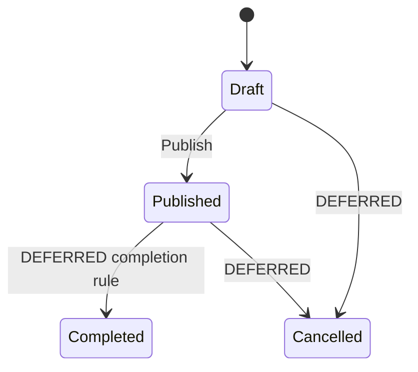
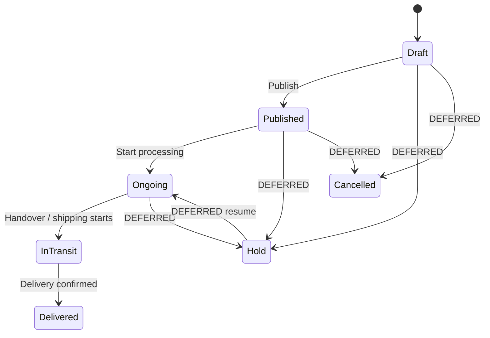
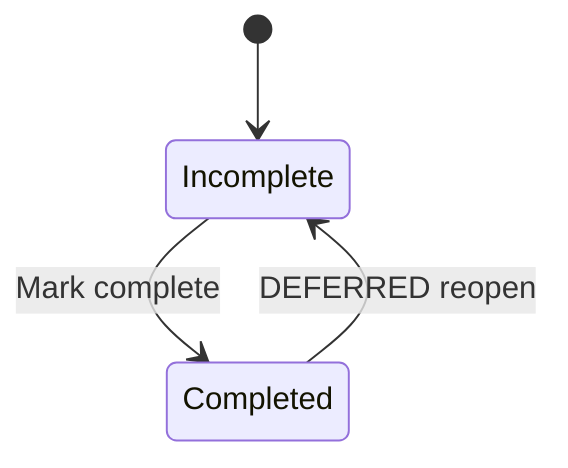
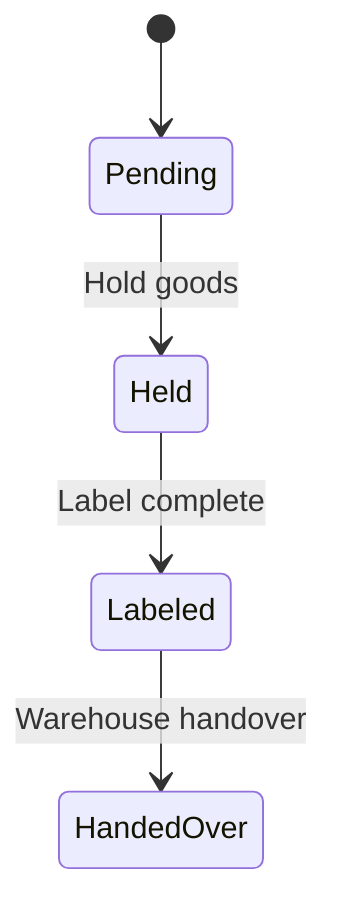
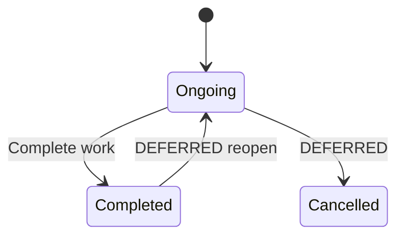
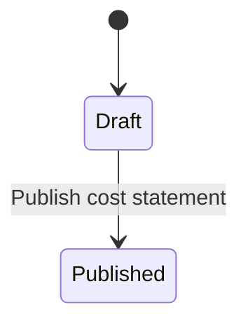

# 04 — Workflow State Machines

## Hệ thống Quản lý Xuất khẩu KDQT (B2B Export Management System)

**Phiên bản:** 0.1  
**Trạng thái:** Draft for Workflow Review  
**Ngày cập nhật:** 2026-08-22  
**Baseline:** `docs/00-project-scope.md`  
**Canonical vocabulary:** `docs/01-domain-glossary.md`  
**Domain Model:** `docs/02-domain-model.md`  
**Business Rules:** `docs/03-business-rules.md`

> Tài liệu này xác định lifecycle states, transition intent, guards, side effects và workflow ownership ở mức nghiệp vụ. Nó không khóa permission implementation, SQL schema, API endpoint, UI component hoặc background-job implementation.

---

# 1. Mục đích

Tài liệu trả lời các câu hỏi:

- entity nào có persisted lifecycle riêng;
- state nào là source-backed, state nào chỉ là normalization;
- transition nào được phép;
- transition được kích hoạt bởi actor/action/business event nào;
- guard nào bắt buộc trước transition;
- side effect nào xảy ra sau transition;
- projection nào chỉ là derived view, không phải lifecycle state riêng;
- điểm nào source chưa đủ để khóa và phải giữ `DEFERRED`.

Workflow **không được dùng để lấp chỗ trống của Business Rules**. Nếu một guard phụ thuộc rule còn `NORMALIZED` hoặc `DEFERRED`, Workflow phải giữ đúng trạng thái đó.

---

# 2. Thứ tự ưu tiên nguồn

1. Baseline đã merge: `00-project-scope.md`, `01-domain-glossary.md`, `02-domain-model.md`, `03-business-rules.md`.
2. Workbook XLSX nghiệp vụ gốc.
3. PPTX yêu cầu nghiệp vụ gốc.
4. `phan_tich_chi_tiet_modules.md` / `website_modules_analysis.md` là nguồn phân tích thứ cấp.

Không tự nâng một transition được mô tả trong tài liệu phân tích thứ cấp thành `LOCKED` nếu baseline/XLSX/PPTX chưa đủ căn cứ.

---

# 3. Trạng thái quyết định Workflow

| Status | Ý nghĩa |
|---|---|
| `LOCKED` | State/transition/effect được source gốc hoặc baseline xác nhận đủ để downstream dùng. |
| `NORMALIZED` | Canonical workflow được đề xuất từ ý định source tương đối rõ nhưng cần business review trước implementation. |
| `DEFERRED` | Source chưa đủ để quyết định. Không được tự implement một interpretation duy nhất. |

---

# 4. Quy ước chung

## 4.1. State khác derived view

Các portal/view sau **không sở hữu lifecycle riêng** nếu chúng chỉ chiếu từ state của entity nguồn:

```text
Customer Planning      <- Booking lifecycle
Customer On The Way    <- Booking lifecycle
Customer Completed     <- Booking lifecycle
Delivery Schedule list <- Booking + LoadingSchedule facts
Payment timing labels  <- Receivable + DueDate + payments
WorkItem IsOverdue     <- Deadline + WorkItem state
```

## 4.2. State khác business fact

Không biến các fact sau thành state nếu source không yêu cầu:

```text
ETD / ATD / ETA / ATA
BatchNumber
BillOfLadingNumber
ShippingOrderNumber
FinalAmount
DueDate
Document completion date
```

## 4.3. Transition phải audit được

Theo `BR-GEN-012`, mọi persisted state change phải tối thiểu truy được:

- entity;
- state trước;
- state sau;
- ai/thành phần nào gây transition;
- thời điểm;
- reason/note nếu action yêu cầu nhập.

Exact audit payload/event schema thuộc `10-audit-notification-design.md` / Data Dictionary.

## 4.4. Permission không được hard-code từ portal name

Workflow mô tả **business actor intent**; exact permission mapping thuộc `05-role-permission-matrix.md`.

Ví dụ:

```text
Warehouse action
KDQT action
System side effect
```

không đồng nghĩa mọi User thuộc portal đó đều có quyền transition.

---

# 5. Order Workflow

## 5.1. Source conflict cần bảo toàn

PPTX/source dùng các wording khác nhau cho Order lifecycle, gồm các ý:

```text
Tạo mới / đơn nháp
Phát hành
Hoàn thành
Đã thanh toán   // xuất hiện ở một số mô tả/view
```

Baseline đã chốt Order có lifecycle riêng nhưng exact final states chưa khóa. `Paid` thuộc semantics của Receivable/Payment và **không được tự biến thành Order state** chỉ vì một source view dùng wording “đã thanh toán”.

## 5.2. State candidates

| State | Status | Semantics |
|---|---|---|
| `Draft` | `LOCKED` | Order đang được tạo/chỉnh trước khi phát hành. Source gọi “Tạo mới/đơn nháp”. |
| `Published` | `LOCKED` | Order đã phát hành; đủ điều kiện làm nguồn cho Booking theo `BR-ORD-006`. |
| `Completed` | `DEFERRED` | Source có wording “Hoàn thành” nhưng chưa định nghĩa completion dựa trên fulfillment, payment hay thao tác tay. |
| `Cancelled` | `DEFERRED` | Scope cho phép lifecycle mở rộng nhưng source chưa khóa transition/cancellation semantics. |

`Paid` hiện **không phải canonical Order state**.

## 5.3. State diagram baseline



Các nhánh `Completed/Cancelled` không được implement như transition bắt buộc trước khi business review.

## 5.4. `Create → Draft`

| Item | Decision |
|---|---|
| Status | `LOCKED` |
| Trigger | Tạo Order mới |
| Result | persisted `Draft` |
| Side effects | chưa tạo Booking eligibility; chưa đẩy Customer Order List như Published Order |

## 5.5. `Draft → Published`

| Item | Decision |
|---|---|
| Status | `LOCKED` về transition intent; một số guards vẫn `NORMALIZED/DEFERRED` |
| Business action | `Publish Order` |
| Actor intent | KDQT/business operator; exact permission sang `05-role-permission-matrix.md` |
| Required baseline facts | Customer; transaction commercial snapshot; OrderLines theo business state |
| Price guards | phải tuân `BR-PRICE-*`; missing/overlap behavior vẫn `DEFERRED` |
| Quantity validation | `BR-ORD-005` đang `NORMALIZED`, nên chưa dùng làm hard guard baseline |
| Contract validity guard | `BR-CUS-006` `DEFERRED`; không được tự block publish vì contract hết hạn nếu business chưa chốt |
| Result | `Published` |
| Side effect 1 | Order trở thành eligible source cho Booking (`BR-ORD-006`) |
| Side effect 2 | Customer Order List có thể chiếu Order đã phát hành theo source portal |
| Financial finalization | exact milestone vẫn `DEFERRED` (`BR-ORD-FIN-005`) |
| Receivable creation | `DEFERRED`; không tự tạo theo publish khi `BR-OPEN-04` chưa khóa |

## 5.6. `Published → Completed`

`DEFERRED`.

Cần business xác nhận `Completed` nghĩa là:

- tất cả OrderLines completed;
- tất cả Bookings delivered;
- Receivable fully paid;
- hoặc action tay độc lập.

Không gộp fulfillment completion và payment completion nếu chưa có quyết định.

## 5.7. Cancellation / reopening

Toàn bộ `Cancelled`, `Reopen`, `Unpublish` hiện `DEFERRED`.

Nếu phase sau cần amendment/unpublish, phải xác định tác động tới:

- existing Bookings;
- transaction snapshots;
- Customer Portal projections;
- Document revisions;
- Receivables/payments;
- audit history.

---

# 6. Booking Workflow

## 6.1. Canonical source-backed state set

Baseline/source đã xác nhận chuỗi chính:

```text
Draft → Published → Ongoing → InTransit → Delivered
```

Mapping source wording:

| Canonical | Source wording |
|---|---|
| `Draft` | Tạo mới / đơn nháp |
| `Published` | Phát hành |
| `Ongoing` | Ongoing |
| `InTransit` | Đang giao |
| `Delivered` | Đã giao |

`Hold` và `Cancelled` được scope cho phép nhưng exact semantics/transitions chưa khóa.

## 6.2. State diagram



## 6.3. `Create → Draft`

| Item | Decision |
|---|---|
| Status | `LOCKED` |
| Guard | source Order phải là Published (`BR-ORD-006`) |
| Data relation | BookingLines trace về eligible OrderLines |
| Over-allocation | `BR-BKG-010/011` vẫn `NORMALIZED`; hard reject chưa được khóa |
| Result | `Draft` |

## 6.4. `Draft → Published`

| Item | Decision |
|---|---|
| Status | `LOCKED` về transition + source side effects; một số guards `NORMALIZED/DEFERRED` |
| Business action | Publish Booking |
| Actor intent | KDQT/business operator |
| Result | `Published` |
| Side effect 1 | Customer Planning projection nhận Booking |
| Side effect 2 | Warehouse portal nhận Booking thuộc primary Warehouse |
| Side effect 3 | KDQT Delivery Schedule có Booking active |
| Side effect 4 | Booking trở thành visible theo các portal/data scopes tương ứng |
| DocumentObligation snapshot | `NORMALIZED` tại publish theo `BR-CUS-034`; cần business acceptance trước hard implementation |
| Financial snapshot finalization | `DEFERRED` |

Không tự tạo Receivable trong transition này.

## 6.5. `Published → Ongoing`

| Item | Decision |
|---|---|
| State pair | `LOCKED` từ baseline/source |
| Trigger/actor | `DEFERRED` |
| Guards | `DEFERRED` |
| Meaning | Booking đang được thực hiện/chuẩn bị vận hành trước khi giao vận thực tế |

Không dùng `Ongoing` để thay thế WorkItem status; hai lifecycle độc lập.

## 6.6. `Ongoing → InTransit`

Source xác nhận một đường kích hoạt quan trọng:

```text
Warehouse LoadingSchedule: “Đã giao hàng”
        ↓
Booking → “Đang giao” / InTransit
        ↓
Delivery Schedule active list cập nhật
```

| Item | Decision |
|---|---|
| Booking state change | `LOCKED` source side effect |
| Warehouse source event | LoadingSchedule đạt “Đã giao hàng” / handed over |
| Direct KDQT transition | `DEFERRED`; source secondary đặt câu hỏi ai thao tác trực tiếp |
| Result | `InTransit` |
| Side effect 1 | Booking không còn ở active Delivery Schedule list (`BR-LOG-005`) |
| Side effect 2 | Customer projection chuyển sang On The Way |
| History | không xóa Booking/DeliverySchedule record |

Exact transport evidence/ATD requirement trước transition chưa khóa.

## 6.7. `InTransit → Delivered`

| Item | Decision |
|---|---|
| State pair | `LOCKED` |
| Trigger/actor | `DEFERRED` — chưa xác nhận KDQT, Warehouse, Customer hay system event |
| Result | `Delivered` |
| Side effect 1 | Customer Completed projection nhận Booking |
| Side effect 2 | Booking amount đủ điều kiện được xem là “Số tiền thực tế” theo `BR-BKG-FIN-003` |
| Financial snapshot finalization | exact timing vẫn `DEFERRED`; không đồng nhất “eligible as actual” với automatic Receivable reconciliation |

## 6.8. Hold / Cancelled

`DEFERRED`.

Cần xác nhận:

- state nào được vào Hold/Cancelled;
- Hold có giữ quantity commitment không;
- Cancelled BookingLine có trả remaining quantity về OrderLine không;
- Published Booking đã sinh document/revision thì xử lý thế nào;
- portal visibility của Hold/Cancelled;
- cost, receivable, payment impact.

---

# 7. OrderLine Fulfillment Workflow

Source yêu cầu từng mã hàng có trạng thái chưa hoàn thành/đã hoàn thành và dòng đã hoàn thành không còn xuất hiện để Booking tiếp.

## 7.1. State set

| State | Status | Meaning |
|---|---|---|
| `Incomplete` | `LOCKED` | OrderLine vẫn còn active/eligible theo fulfillment rules. |
| `Completed` | `LOCKED` | Không còn eligible cho Booking mới. |

Không thêm persisted `PartiallyFulfilled` ở baseline hiện tại. Partial/remaining quantity được derive qua BookingLines.

## 7.2. Diagram



## 7.3. Completion transition

| Item | Decision |
|---|---|
| Status | `LOCKED` về effect |
| Action | Mark Product/OrderLine completed |
| Side effect | loại khỏi Booking selector tiếp theo (`BR-ORD-007`, `BR-BKG-014`) |
| Historical BookingLines | giữ nguyên; không xóa |
| Auto-complete based on booked quantity | `DEFERRED` |
| Reopen | `DEFERRED` |

`Completed` không tự suy ra Order `Completed` cho đến khi Order completion semantics được khóa.

---

# 8. BookingLine Fulfillment Workflow

Source Booking cho phép cập nhật trạng thái từng mã hàng. Exact relationship với OrderLine completion chưa được mô tả đủ.

## 8.1. Candidate states

| State | Status |
|---|---|
| `Incomplete` | `NORMALIZED` |
| `Completed` | `NORMALIZED` |

Các state này phản ánh source “mã hàng chưa hoàn thành / đã hoàn thành”, nhưng exact transition semantics cần business review.

## 8.2. Open questions

`DEFERRED`:

- BookingLine completed khi đủ booked quantity, đủ batch, shipped, hay người dùng mark tay?
- tất cả BookingLines completed có tự đẩy Booking state không?
- BookingLine completion có tự mark OrderLine completion không?
- reopen/correction sau delivery xử lý thế nào?

Không tự đồng bộ các lifecycle này nếu chưa có rule.

---

# 9. Warehouse LoadingSchedule Workflow

Source Warehouse xác nhận workflow:

```text
Đã hold hàng → Đã dán tem → Đã giao hàng
```

## 9.1. State set

| Canonical | Status | Source wording |
|---|---|---|
| `Pending` | `NORMALIZED` | trạng thái ban đầu trước “Đã hold hàng”; source không đặt tên rõ |
| `Held` | `LOCKED` | Đã hold hàng |
| `Labeled` | `LOCKED` | Đã dán tem |
| `HandedOver` | `LOCKED` | Đã giao hàng |

Dùng `HandedOver` thay vì `Delivered` trong canonical internal wording để tránh nhầm với Booking `Delivered` tới Customer. UI có thể giữ wording nghiệp vụ “Đã giao hàng”.

## 9.2. Diagram



## 9.3. Transition rules

| Transition | Status | Effect |
|---|---|---|
| `Pending → Held` | `NORMALIZED` | source có Held nhưng chưa đặt tên initial state/guard |
| `Held → Labeled` | `LOCKED` sequence intent |
| `Labeled → HandedOver` | `LOCKED` sequence intent |
| `HandedOver` side effect | `LOCKED` | Booking chuyển `InTransit`; Delivery Schedule cập nhật |

`DEFERRED`:

- có được skip state không;
- có được rollback state không;
- batch completion có là guard;
- label requirement có điều kiện theo Product/Customer không;
- exact Warehouse role/permission.

---

# 10. Batch Handling Workflow

Source Warehouse có hai nhóm hiển thị:

```text
Booking chưa có batch
Booking đã có batch + Hoàn thành / Chưa hoàn thành
```

Domain Model tách `Batch` và `BatchAllocation`; vì vậy không tạo một global `BatchStatus` chỉ để phản ánh UI group.

## 10.1. Fulfillment projection

`Batch completion` hiện là `DEFERRED` theo `BR-BAT-006`.

Có thể tồn tại derived view:

```text
MissingBatchInformation
BatchInformationPresent
BatchHandlingComplete
```

nhưng exact persisted status chưa baseline.

Không khóa workflow riêng cho Batch trước khi xác nhận “Hoàn thành” nghĩa là:

- đã nhập đủ batch numbers;
- allocated quantity đủ;
- QA complete;
- hay thao tác tay.

---

# 11. WorkItem Workflow

Source Operations xác nhận `Ongoing` và `Completed`.

## 11.1. State set

| State | Status |
|---|---|
| `Ongoing` | `LOCKED` |
| `Completed` | `LOCKED` |
| `Cancelled` | `DEFERRED` |

## 11.2. Diagram



## 11.3. Rules

- WorkItem có Primary PIC, Deadline, Status.
- `IsOverdue` là derived; exact completion-equivalent semantics đang `NORMALIZED` theo `BR-OPS-002`.
- Completing WorkItem có thể cập nhật reporting/milestone projection, nhưng không tự đổi Booking state nếu chưa có explicit rule.
- Reopen/Cancel/Blocked status chưa source-backed.

---

# 12. OperationalMilestone

`OperationalMilestone` là fact/event timeline, **không phải state machine chung**.

Các milestone như ETD/ATD/ETA/ATA, Customs Clearance, Invoice/PL/CO/HC dates, Docs Sent... được ghi nhận theo authoritative owner đã khóa trong Domain Model/Business Rules.

Không tạo workflow enum kiểu:

```text
InvoiceIssued → CustomsCleared → COIssued → ...
```

vì các mốc có thể song song và không phải một linear lifecycle duy nhất.

---

# 13. BookingCostStatement Workflow

Source xác nhận:

- chi phí được nhập theo Booking;
- Finance chỉ đọc/download;
- mô tả portal nói chi phí do KDQT nhập/phát hành.

## 13.1. Candidate states

| State | Status | Meaning |
|---|---|---|
| `Draft` | `NORMALIZED` | KDQT đang nhập/chỉnh CostItems. |
| `Published` | `NORMALIZED` | Cost statement được phát hành để Finance đọc như business snapshot. |

Source chưa đủ để coi exact two-state lifecycle này là `LOCKED`; `BR-COST-010` vẫn deferred.

## 13.2. Diagram proposal



`DEFERRED`:

- edit after publish;
- revision/versioning;
- approval/reject;
- unpublish;
- FX recalculation after publish;
- publish guard khi cost chưa đầy đủ.

Finance không phải workflow actor cập nhật CostStatement trong baseline scope.

---

# 14. DocumentObligation Workflow

`DocumentObligation` biểu diễn chứng từ phải chuẩn bị cho Booking.

## 14.1. Không khóa persisted state machine ở baseline

Source Customer Planning cần biết:

- chứng từ nào phải chuẩn bị;
- tình trạng/ngày hoàn thành.

Canonical projection có thể derive:

```text
Pending
Fulfilled
```

nhưng exact fulfillment rule khác nhau theo DocumentType và chưa source-backed đủ để khóa một workflow chung.

## 14.2. Snapshot boundary

`BR-CUS-034` đề xuất (`NORMALIZED`) snapshot obligations khi Booking `Published`.

Workflow không nâng rule này thành hard side effect cho đến khi Business Review xác nhận.

---

# 15. BusinessDocument Workflow

Baseline phân biệt:

```text
SystemGenerated
ExternalUploaded
```

Đây là source type, **không phải lifecycle states**.

Hiện chưa có source đủ mạnh cho universal:

```text
Draft → Submitted → Approved → Rejected
```

Do đó document approval workflow vẫn `DEFERRED`.

Locked/known behavior:

- generated revision giữ TemplateVersion;
- revision cũ không bị rewrite;
- BusinessDocument phải có direct subject hợp lệ;
- generated docs dùng transaction snapshots.

DocumentType-specific workflow sẽ chỉ được thêm khi business/source xác nhận.

---

# 16. Order / Booking Financial Snapshot Finalization

Business Rules cố ý defer exact milestone khi financial snapshot “becomes final”.

Do đó **không tạo persisted state machine** như:

```text
DraftAmount → Finalized → Posted
```

ở phase này.

Workflow chỉ bảo toàn:

```text
Order.FinalAmount   = expected / issued amount
Booking.FinalAmount = actual fulfilled amount
Receivable.AmountDue = separate fact
```

`Published`, `Delivered` hoặc payment event **không tự động đồng nhất** với financial posting/reconciliation nếu `BR-OPEN-03/04/05` chưa được giải quyết.

---

# 17. Receivable / Payment Workflow Boundary

`Receivable` hiện có business facts và derived timing labels, nhưng exact generation/reconciliation lifecycle chưa khóa.

Không tự tạo states:

```text
Draft / Open / PartiallyPaid / Paid / Overdue
```

như persisted workflow baseline.

Có thể derive:

- outstanding amount;
- unpaid/fully paid projection;
- overdue/due soon/within due labels;

nhưng exact state partition còn phụ thuộc `NORMALIZED` rules `BR-REC-030..034` và open decisions.

`PaymentTransaction` là transaction records, không phải state machine.

---

# 18. Portal Projection Matrix

| Source lifecycle/fact | Portal projection | Status |
|---|---|---|
| Order `Published` | Customer Order List | `LOCKED` source intent |
| Booking `Published` | Customer Planning | `LOCKED` |
| Booking `Published` | Warehouse assigned Booking list | `LOCKED` |
| Booking `Published` | KDQT active Delivery Schedule | `LOCKED` |
| Booking `InTransit` | Customer On The Way | `LOCKED` |
| Booking `InTransit` | removed from active Delivery Schedule list | `LOCKED` |
| Booking `Delivered` | Customer Completed | `LOCKED` |
| Receivable outstanding | Customer Payment Schedule | source intent `LOCKED`, exact status formula follows Business Rules |
| Warehouse LoadingSchedule | warehouse-only quantity/logistics view | `LOCKED` data scope |
| CostStatement Published proposal | Finance cost view | `NORMALIZED` until cost workflow confirmed |

Projection update không tạo duplicate authoritative status ở portal.

---

# 19. Workflow Side-Effect Chain quan trọng

## 19.1. Booking publish

```text
Booking Draft
   │ Publish
   ▼
Booking Published
   ├── Customer Planning
   ├── Warehouse Booking list
   └── KDQT Delivery Schedule
```

## 19.2. Warehouse handover

```text
LoadingSchedule Labeled
   │ Warehouse: Đã giao hàng
   ▼
LoadingSchedule HandedOver
   │
   └── Booking → InTransit
         ├── Customer On The Way
         └── remove from active Delivery Schedule
```

## 19.3. Booking delivery

```text
Booking InTransit
   │ Delivery confirmed
   ▼
Booking Delivered
   ├── Customer Completed
   └── Booking FinalAmount becomes eligible as "actual fulfilled amount"
       (NOT automatic Receivable reconciliation)
```

---

# 20. Notifications

In-app notification là In Scope, nhưng exact notification matrix chưa baseline.

Workflow nên phát business events đủ để notification design downstream có thể subscribe, ví dụ:

```text
OrderPublished
BookingPublished
BookingEnteredInTransit
BookingDelivered
LoadingScheduleHandedOver
WorkItemCompleted
WorkItemOverdueDetected
```

Danh sách trên là **design event candidates**, không phải external integration contract.

Email/SMS/push external channels vẫn Future Scope.

---

# 21. Critical Workflow Open Decisions

Các mục sau phải được xác nhận hoặc explicitly defer trước khi Workflow được coi là fully baselined:

## WF-OPEN-01 — Order completion semantics

`Completed` dựa trên:

```text
all OrderLines complete?
all Bookings delivered?
fully paid?
manual action?
```

## WF-OPEN-02 — Order cancellation/unpublish/amendment

Xác nhận allowed transitions và downstream effects.

## WF-OPEN-03 — Booking `Published → Ongoing`

Xác nhận actor, trigger và guards.

## WF-OPEN-04 — Booking direct transition to `InTransit`

Warehouse `HandedOver → Booking InTransit` đã source-backed. Cần xác nhận KDQT có được chuyển trực tiếp hay không.

## WF-OPEN-05 — Booking `InTransit → Delivered`

Xác nhận actor/evidence/guard.

## WF-OPEN-06 — Hold / Cancelled semantics

Đặc biệt quantity commitment, portal visibility và financial/document effects.

## WF-OPEN-07 — OrderLine / BookingLine completion synchronization

Manual hay derived; có auto-complete hay không; reopening rules.

## WF-OPEN-08 — Warehouse initial/loading transition rules

Xác nhận `Pending`, skip/rollback, batch/label guards.

## WF-OPEN-09 — CostStatement lifecycle

Draft/Published có đúng không; revision/approval/edit-after-publish.

## WF-OPEN-10 — Document obligation/document approval lifecycle

Xác nhận fulfillment criteria và document-type-specific approval nếu có.

## WF-OPEN-11 — Financial snapshot finalization

Mốc Order/Booking amount được coi là final; relationship với publish/delivery/amendment.

## WF-OPEN-12 — Receivable lifecycle

Generation/open/partial/full payment và reconciliation vẫn phụ thuộc `BR-OPEN-04/05`.

---

# 22. Decisions delegated downstream

## `05-role-permission-matrix.md`

Khóa:

- ai có thể thực hiện từng transition;
- data scope theo Customer/Warehouse/Region;
- transition permissions theo current state.

## `06-data-dictionary.md`

Khóa:

- enum/state codes;
- timestamps;
- transition reason fields;
- nullable/required fields;
- concurrency/version fields nếu có.

## `07-api-contract-guidelines.md`

Khóa chuẩn command endpoints/actions, optimistic concurrency và error semantics; không encode permission bằng route naming.

## `10-audit-notification-design.md`

Khóa audit event payload và notification subscriber rules.

---

# 23. Definition of Done

Workflow artifact được xem là ready để baseline khi:

- [x] Order và Booking lifecycle ownership được tách rõ.
- [x] Portal projections không bị model thành duplicate lifecycle.
- [x] Warehouse handover → Booking InTransit side effect được ghi nhận.
- [x] OrderLine completion effect được ghi nhận.
- [x] WorkItem lifecycle tách khỏi Booking lifecycle.
- [x] OperationalMilestone không bị ép thành linear state machine.
- [x] Documents/financial snapshots không bị tự phát minh approval/posting lifecycle.
- [x] Business Rules `NORMALIZED/DEFERRED` không bị nâng cấp ngầm thành hard guards.
- [ ] Business review xác nhận các `NORMALIZED` workflow decisions.
- [ ] WF-OPEN-01 → WF-OPEN-12 được giải quyết hoặc explicitly accepted as deferred.
- [ ] Independent PR review xác nhận không còn hidden workflow assumptions/blockers.

---

# 24. Version History

| Version | Date | Description |
|---|---|---|
| 0.1 | 2026-08-22 | Draft đầu tiên sau khi merge Business Rules; chuẩn hóa Order/Booking/OrderLine/LoadingSchedule/WorkItem workflow, bảo toàn các ambiguity về completion/cancellation/financial/document lifecycle và liệt kê 12 critical workflow open decisions. |
